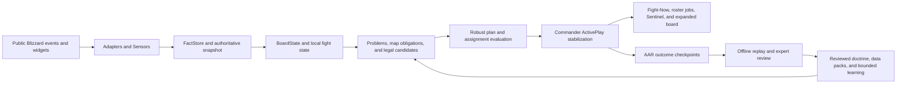

# KWR Expert-Tier Battlefield Master Plan

Status date: 2026-07-29  
Plan ID: `KWR-036`  
Current Commander candidate: `6.1.0-alpha.28`  
Target: field-proven expert-tier Rated Battleground command assistant

## Authority and purpose

`RELEASE_VISION.md` remains authoritative for suite scope, component ownership,
repository recovery, and release sequencing. This file is the forward execution
authority for taking the Commander from the recovered alpha candidate to an
expert-tier battlefield release.

Existing plans remain useful evidence:

- `ALPHA_S_TIER_MASTER_PLAN.md` owns the alpha engineering-quality baseline.
- `PILLAR_EXECUTION_SHEET.md` and `S_TIER_EXECUTION_SCORECARD.md` preserve
  subsystem history and evidence.
- `PRODUCT_ROADMAP.md` preserves the original 10/10 product and data direction.
- `RELEASE_READINESS.md` and `WINNING_STATE_RELEASE_GATES.md` remain the gate
  decision for the current alpha candidate.
- dated task briefs and field reports remain the evidence for the work they
  describe.

When an older forward-looking backlog conflicts with this plan, this plan owns
the expert-tier order. It does not rewrite completed history or weaken a current
release gate.

## Objective

Deliver a trustworthy command system that turns legally obtainable
battleground evidence into:

1. one stable current call;
2. one conditional next call;
3. one assignment per player;
4. one local kill and control package when the evidence supports it;
5. explicit success and abort conditions;
6. an auditable record of what happened next.

The final system must improve a human commander's speed, coverage, consistency,
and counterplay without pretending to see hidden information or playing the
game automatically.

## User outcome

During a real Rated Battleground:

- the commander can read the win path and issue the current call at a glance;
- every player can see their current job and location;
- the team can distinguish defense, offense, kill, and control responsibilities;
- the next move states who moves, where, when, and what event triggers it;
- uncertain information stays visibly uncertain;
- the commander remains the final authority and may accept, reject, or override
  the recommendation;
- the AAR can explain whether the decision was sound, whether the team executed
  it, and why the outcome changed.

Outside the match:

- maintainers can replay the same evidence deterministically;
- expert reviewers can label acceptable and dangerous calls;
- benchmarks can compare engine revisions without relying on anecdotes;
- reviewed learning can improve tie-breaks without corrupting live truth;
- release claims can be supported by reproducible offline and live evidence.

## Honest product claim

The target claim is:

> KWR produces safe, stable, expert-aligned battlefield recommendations from
> the public information available to a WoW addon and helps a human leader
> execute those recommendations consistently.

KWR must not claim:

- guaranteed wins;
- the ability to counter every opponent;
- access to everything a human can see or hear;
- knowledge of hidden talents, cooldowns, auras, positions, intent, or voice
  communication;
- calibrated win probability before calibration evidence exists;
- 2400-level performance before testing in comparable rated or controlled
  expert competition.

## Current verified baseline

The current baseline is a strong commander alpha, not an empty project.

### Implemented and offline-proven

- one `MatchRuntime`, one `Store`, one `Strategist`, and one `Commander`;
- sanitized team-relative score, objective, roster, enemy, and Reporter truth;
- deterministic assignments and bounded local teamfight optimization;
- reviewed map doctrine, composition archetypes, counter sequences, and
  opener/recovery/endgame branches;
- stable current/candidate ActivePlay arbitration;
- Fight-Now score, win path, current/next call, posture, kill, CC, and
  assignment presentation;
- bounded AAR, verification, diagnostics, performance telemetry, and package
  tooling;
- deterministic smoke and 500-refresh soak coverage;
- fail-closed knowledge freshness and unknown handling.

### Field-provisional

- Retail lifecycle and complete-match convergence;
- taint, secure-action, and combat-lockdown behavior;
- live CPU and memory budgets;
- all-map and all-resolution visual proof;
- real-world quality of local fight evidence;
- opponent and objective movement quality under live API restrictions;
- Sentinel routing in complete battleground cycles.

### Open field blockers

- `KWR-032`: expanded Team health and specialization provenance;
- `KWR-033`: command churn and AAR stability semantics;
- `KWR-034`: raw flag-event prose entering the command-target path;
- `KWR-035`: offline-complete Fight-Now UI still requires direct Retail
  verification.

These defects remain ahead of new expert-tier behavior.

### Important intelligence gap

The architecture declares more advanced problems than live sensors currently
prove. Several problem types are either partial, dormant, or connected only
when optional fields happen to exist. Expert-tier work must complete the
evidence path or remove the live claim; adding more scoring weight is not a
substitute.

### Critical architecture repairs before smarter scoring

The expert audit identified several concrete correctness gaps that must be
fixed before tuning decisions:

1. `MatchRuntime` currently evaluates the local teamfight path before the
   current Reporter, opponent, macro strategy, assignment, and coverage result
   is complete. The tactical solver therefore cannot enforce the latest macro
   obligations.
2. Protected defender/carrier filtering occurs too late in parts of the
   execution path. A later formatter can remove an incompatible control job
   after kill selection already counted that control as support. Protection
   must become an optimizer hard constraint, and kill feasibility must be
   recalculated when support is unavailable.
3. Current fact/evidence records are not yet rich enough for expert reasoning.
   Problem authorization requires field-specific source, authority, TTL,
   expiry, and lineage—not merely an evidence ID attached to a roster identity.
4. Several map/global problems are represented as if an enemy player were the
   subject. Rotation gaps, node spin, friendly-healer pressure, and respawn
   windows require objective, friendly, or global subjects.
5. Tactical scoring still contains coarse role defaults and fixture-oriented
   fixed-name preferences. Production scoring must come from reviewed
   specialization capability, safe availability/locality, explicit sourced
   preference, and target-specific fit.
6. Kill support is currently too global. A control assignment against an
   unrelated enemy must never inflate confidence in the selected kill target.
7. The local tactical result can surface independently of macro ActivePlay
   compatibility. `Commander` must approve a tactical package against the
   current play, coverage cost, success condition, and abort condition.
8. Unknown/default resource values can currently contribute to a supposed wave
   advantage in one doctrine path. Absence or equality at zero must remain
   unknown unless a real safe population/timing source supports the advantage.

These are bounded repairs to the existing architecture, not justification for
a parallel strategy engine.

## Definition of expert tier

KWR reaches expert tier only when all six dimensions pass together.

| Dimension | Required result |
| --- | --- |
| Truth | Every decision input has a legal source, age, confidence, expiry, and authority. Unknown never becomes fact. |
| Decision quality | Reviewed experts accept the high-confidence call, fallback, and stop rule at the required benchmark rate. |
| Execution quality | Assignments preserve objective coverage, arrival feasibility, local control, and clear abort conditions. |
| Usability | A commander can read and repeat the current call without opening an analysis page or decoding technical language. |
| Validation | The same timeline produces the same result offline; adversarial and live evidence contain no fabricated or illegal call. |
| Operations | Knowledge is fresh, packages are reproducible, failures are diagnosable, and rollback is documented. |

An aggregate score cannot hide a failure in truth, safety, or field
stability.

## Final battlefield experience

### Before the gate opens

The expanded Command Center prepares:

- detected map, side, ruleset, score limit, and public objective model;
- friendly roster, effective roles, safely known specialization provenance,
  and composition capabilities;
- enemy roster and composition only to the confidence safely supported;
- one safe default opener and up to two reviewed alternatives;
- one player, one job, one location, one backup responsibility;
- the first switch trigger and first stop rule;
- any information that remains unknown.

The commander confirms or overrides the plan. KWR never sends the call
automatically.

### During live combat

The compact battlefield path contains only three visual layers.

#### Layer 1 - always visible

- current score and honest projected direction;
- short win path;
- next scoring objective;
- current call with **WHAT / WHO / WHERE / WHEN**;
- current defense and offense posture;
- local **KILL/PRESS** target when reviewed evidence supports it;
- local **CC/STOP** target and assignee;
- friendly and enemy health rows where Blizzard safely permits direct display;
- the player's current synchronized job on their row.

#### Layer 2 - visible only when changed

- the next call and its trigger;
- a decisive carrier, node, cart, orb, resource, resurrection, or score change;
- a defender gap, failed arrival, protected kill target, or urgent local peel;
- one short success or abort message.

Only one attention-demanding advisory may own the local combat emphasis.

#### Layer 3 - on demand

- evidence age and source;
- confidence budget;
- alternatives and opportunity cost;
- map doctrine and composition model;
- complete roster and enemy notes;
- performance, verification, and decision diagnostics.

These details belong in the expanded board, `/kwrwhy`, `/kwr verify`, or AAR,
not in the fight-now card.

### After the match

The AAR records:

- match and ruleset context;
- authoritative score and objective transitions;
- commands actually published;
- candidates suppressed by stability logic;
- player overrides;
- assignments and coverage;
- expected 5/15/30/60-second transitions where applicable;
- observed outcome;
- execution, sensor, opponent, and decision-quality classifications;
- expert or user review;
- a bounded export suitable for offline replay.

Learning occurs only after truth qualification and explicit review.

## Human-in-the-loop operating contract

KWR advises. The player leads.

- KWR may calculate, display, highlight, prepare fixed secure buttons out of
  combat, and copy text after a hardware click.
- KWR never moves, targets, focuses, casts, communicates, binds keys, or changes
  protected attributes automatically.
- The commander decides whether to speak or send the call.
- An override is recorded as evidence, not treated as user error.
- Low evidence produces `VERIFY`, `HOLD`, or a safe default instead of false
  precision.
- A strong opponent can still out-execute or counter a reasonable call. The AAR
  must distinguish this from a bad recommendation.

## Authoritative system loop



The target refresh order is:

1. Sensors, ObjectiveIntel, CombatIntel, Reporter, and OpponentModels collect
   and reconcile current safe evidence.
2. FactStore and BoardState expose one normalized decision read.
3. Predictor and Strategist select the macro candidate.
4. macro Assignments and assignment integrity establish protected coverage.
5. TeamfightCommandPlanner solves local problems inside those hard constraints.
6. Commander accepts, suppresses, or stabilizes the compatible combined play.
7. ExecutionCommandBuilder formats the approved result only.
8. Store publishes one command packet and AAR observes it.

This ordering and the macro/tactical command contract require an ADR before
implementation because they affect several module boundaries.

The loop retains one live authority:

- adapters isolate unstable Blizzard APIs;
- sensors collect observations;
- `FactStore` and the existing snapshot own live truth;
- `BoardState` is a read-only decision model;
- `Strategist` owns macro comparison;
- `Intelligence` modules own bounded tactical problem solving;
- `Assignments` owns one-player/one-job coverage;
- `Commander` owns call publication and stabilization;
- UI renders Store state only;
- AAR and offline tools may evaluate but never mutate live truth.

The expert `BoardState` extension must include macro locks, assignment
continuity, protected jobs, safe arrival bands, first-class carriers,
objective/global problem subjects, resurrection/regroup state where public,
control coverage, evidence lookup, and confidence budget. It remains an
internal read model and is not copied wholesale into Store.

## Battlefield evidence contract

Every decision-relevant field must declare:

```text
value
source
observedAt
expiresAt
confidence
authority
evidenceIDs
lineage
```

Allowed authorities:

- `LIVE`: current public scoreboard, widget, objective, roster, or unit truth;
- `OBSERVED`: safely visible target, focus, mouseover, nameplate, ally-target,
  aura, cast, or event evidence;
- `DERIVED`: deterministic arithmetic or classification from live/observed
  inputs;
- `LIKELY`: multiple independent bounded signals;
- `POSSIBLE`: strategically relevant but incomplete;
- `META`: dated build-time aggregate knowledge;
- `LEARNED`: reviewed bounded history;
- `UNKNOWN`: not available.

Authority order is strict. `META` and `LEARNED` may break ties but never replace
live score, objective, carrier, roster, visibility, or feasibility truth.

Evidence used to authorize a problem must prove the relevant field, not only
the subject's identity. Multiple facts derived from the same observation
lineage count once when confidence is combined. Reconciliation must preserve
the original observation time instead of making old evidence fresh merely
because a snapshot was rebuilt.

### Signal coverage matrix

| Battlefield question | Current posture | Expert-tier source and rule |
| --- | --- | --- |
| Score and projected direction | Connected | Public score/widgets; projection remains directional until calibrated. |
| Objective ownership/state | Connected with live proof still required | Public widgets, POIs, vignettes, and reviewed objective events; conflicts fail closed. |
| Friendly roster/role/spec | Connected, provenance field defect open | Scoreboard/group/inspect-safe evidence with historical labels preserved. |
| Friendly health | Compact path connected; expanded path field defect open | Direct unit-backed display; no secret-value arithmetic. |
| Enemy roster/class/spec | Connected when scoreboard exposes it | Roster identity is not visibility or location evidence. |
| Enemy visible/local/last seen | Connected but field-provisional | Fixed target/focus/mouseover/nameplates/ally targets with TTL and source. |
| Carrier identity/state | Connected, command-target repair open | Public carrier aura, widget, and normalized system-event evidence. |
| Priority cast | Partial | Only safely observed unit-cast evidence and reviewed spell data. |
| Defensive/trinket state | Partial/usually unknown | Only explicitly observed permitted evidence; readiness is never assumed. |
| Local kill opportunity | Connected for bounded cases | Visible/local evidence, direct display-safe health, protection state, support control, and explicit uncertainty. |
| Healer control | Connected for current/recent local healers | Visible/recent local healer evidence plus reviewed control capability and DR state. |
| Objective/base threat | Partial | Objective transition plus coverage deficit, local observation, assignment failure, or public incoming evidence. |
| Friendly healer pressure | Declared but not fully connected | Friendly healer state plus visible/local hostile engagement; never infer hidden incoming damage. |
| Missing stealth threat | Declared/partial | Roster-known stealth capability plus last-observed age and exposed objective; describes risk, never location. |
| Enemy cooldown window | Declared/partial | Starts only from an observed reviewed ability or aura; timer expiry is an estimate, not proof of readiness. |
| Rotation gap | Declared/dormant | Friendly assignments, objective obligations, safe ETA, death/connection, and coverage; no fabricated enemy coordinates. |
| Node spin required | Declared/dormant | Public contested/capture state, current defender coverage, and reinforcement ETA. |
| Respawn-wave advantage | Declared/dormant | Friendly death/respawn truth and only public enemy death/rez evidence; otherwise express friendly regroup timing, not enemy certainty. |
| Opponent response pattern | Partial | Current-match and reviewed season-scoped observations with minimum samples and conservative confidence. |

For every row, expert-tier completion requires:

1. a legal source adapter or a documented unavailable boundary;
2. a normalized fact and TTL;
3. deterministic conflict and expiry behavior;
4. a detector or consumer;
5. a conservative fallback;
6. a replay fixture;
7. a live verification procedure;
8. an AAR explanation.

If any step is absent, the feature stays disabled, advisory-only, or unknown.

## Strategic decision target

The current five-candidate heuristic is the baseline. The expert-tier planner
must become a bounded response planner, not an unbounded simulator and not a
machine-learning black box.

### Candidate contract

Each candidate contains:

```text
action
target
movers
stayers
arrivalWindow
objectiveCoverage
localFightPackage
successCondition
abortCondition
fallback
requiredEvidence
missingEvidence
enemyResponses
opportunityCost
confidence
```

### Decision order

Use a lexicographic safety-first decision order:

1. preserve the actual win condition;
2. reject illegal, impossible, stale, or uncovered plans;
3. satisfy must-cover objectives and protected assignments;
4. compare objective conversion or denial;
5. compare arrival and resurrection feasibility;
6. compare composition and local fight fit;
7. test bounded likely enemy responses;
8. penalize uncertainty, travel risk, and command churn;
9. select one call and one fallback;
10. publish only after ActivePlay stabilization or a decisive bypass.

Do not collapse hard safety constraints into a score that a large offensive
bonus can override.

### Bounded adversary model

For each legal candidate, compare no more than a reviewed small set of plausible
enemy responses:

- reinforce;
- trade;
- bunker/stall;
- counter-rotate;
- collapse;
- disengage/reset;
- stealth pressure where roster evidence supports the risk.

Evaluate one or two decision horizons. The planner must have fixed candidate,
branch, node, and runtime limits supplied by the active ruleset.

Use robust regret:

- prefer the plan that remains acceptable across plausible responses;
- prefer a safe fallback when response evidence is weak;
- do not publish numerical win probability unless calibrated;
- record the rejected alternative and the evidence that would have changed the
  selection.

## Tactical execution target

Macro and local fight decisions must agree.

The final tactical solver must jointly consider:

- protected objective jobs;
- carrier and defender obligations;
- friendly role, specialization, reviewed capability, death, connection, and
  safe arrival feasibility;
- local healers and support-control needs;
- kill target protection and safely observed defensive state;
- DR state and control-category compatibility;
- CC overlap and backup control;
- damage pressure and kill-confirm compatibility;
- peel needs;
- opportunity cost of pulling each player away;
- current and next objective timing;
- success, abort, and handoff conditions.

Required outputs:

- one primary kill or pressure target;
- zero to three control assignments only when independently useful;
- one caller/trigger;
- one backup when the primary assignment becomes invalid;
- explicit players who remain on defense;
- a conservative clear state when local evidence expires.

The solver may recommend a target. It never selects it for the player.

## Offline Competitive Decision Lab

The Decision Lab is the highest-priority new offline system. It turns KWR from
a plausible strategist into a measurable one.

### Repository shape

Extend the existing boundaries:

```text
knowledge/
  schemas/
  provenance/
  reviewed/
  fixtures/
  generators/

tests/
  replays/
  golden/
  adversarial/

tools/
  replay-test-runner.lua
  decision-benchmark.ps1
  corpus-audit.ps1
  outcome-report.ps1
```

JSON may be used for developer-side replay fixtures and generated reports.
Generated runtime knowledge remains compact Lua and requires no JSON parser in
the addon.

### Replay record

Each sanitized replay includes:

- schema, patch, season, ruleset, map, side, and source;
- consent/provenance and redaction status;
- initial roster and safe composition facts;
- timestamped public fact transitions;
- commander output transitions;
- assignment transitions;
- user overrides;
- authoritative score/objective outcome;
- unavailable fields explicitly marked unavailable;
- expert labels and reviewer agreement;
- expected safety invariants.

Character and account identifiers are removed, salted for one replay, or
replaced with role labels. Raw secret values are never exported.

### Golden decision label

A fixture does not require one brittle exact sentence. Reviewers label:

- acceptable primary actions;
- acceptable fallback actions;
- dangerous or forbidden actions;
- must-stay defenders;
- required movers/capabilities;
- valid target classes when local evidence exists;
- required success and abort conditions;
- maximum acceptable delay;
- evidence that should force uncertainty;
- short rationale.

High-disagreement cases become conservative fixtures rather than false ground
truth.

### Corpus tiers

| Tier | Purpose | Minimum final-release evidence |
| --- | --- | --- |
| Synthetic state matrix | Exhaust safety, expiry, contradiction, and map-state combinations | At least 1,000 deterministic cases across every supported map and phase |
| Timeline replay | Exercise churn, arrival, lifecycle, carrier, score, and objective transitions | At least 10 complete or representative timelines per certified map-mode profile |
| Expert-reviewed golden set | Measure call quality and dangerous-call avoidance | At least 50 independently reviewed decision states per certified map-mode profile |
| Adversarial mutation set | Prove fail-closed behavior under stale, missing, reordered, duplicated, or contradictory evidence | Mutations for every fact authority and every urgent problem class |
| Live truth-qualified corpus | Compare offline behavior with actual Retail outcomes | Promotion thresholds defined in the live certification section |

Standard certification therefore requires at least 500 reviewed decision
states and 100 timelines across the ten current map profiles. If the four
separately modeled Blitz variants are included in the release claim, the floor
becomes 700 reviewed states and 140 timelines across fourteen profiles.

Every enabled problem type requires at least 25 positive and 25 difficult
negative examples. Twenty percent of the expert-reviewed corpus remains sealed
from tuning and is opened only for a promotion benchmark.

These are minimum coverage gates, not proof that more examples cannot expose a
failure.

### Offline benchmark gates

- 100% deterministic output for identical ruleset, knowledge pack, and replay;
- zero protected-action, secret-value, fabricated-location, or unknown-to-fact
  violation;
- zero forbidden/catastrophic call in the golden corpus;
- at least 85% of primary actions inside the expert-approved set overall and
  at least 80% for every certified map-mode profile;
- at least 90% agreement on consensus must-call cases;
- at least 97% expert-acceptable action present in the top three internal
  candidates;
- at least 95% correct abstention or conservative verification when truth is
  insufficient;
- disagreement or missing evidence produces a conservative output;
- median reviewed regret no greater than 10% of the best acceptable candidate
  under the rubric;
- zero critical tactical error;
- at least 90% expert acceptance of the local kill/CC package when its truth is
  qualified;
- every current call names WHAT, WHO, WHERE, and WHEN;
- every objective commit names success and abort conditions;
- every assignment set preserves must-cover obligations;
- noisy event replays meet the active command-stability budget;
- planner work remains inside its bounded node and runtime budget.

Expert acceptance measures legality and decision quality, not matching one
reviewer's wording.

### Adversarial and metamorphic invariants

- removing evidence cannot increase certainty or authorize a more aggressive
  commit;
- stale evidence never becomes current because a snapshot refreshed;
- roster order and Lua table insertion order do not change the result;
- assigned-side inversion produces the corresponding legal symmetric result;
- same inputs, rules, and data hashes produce the same call, assignments, and
  explanation;
- same-short-name players remain distinct;
- nil, malformed, secret, unsupported, and wrong-type API results fail
  conservatively;
- fresh authoritative objective truth cannot be downgraded by a weaker source;
- local sighting evidence cannot become a global map coordinate;
- one player cannot receive conflicting simultaneous jobs;
- a protected defender or carrier cannot be removed without a valid
  replacement;
- visibility or historical identity alone cannot qualify a kill target;
- noise cannot churn an unchanged call, while decisive score, carrier,
  objective, or match-end changes bypass stabilization;
- event storms are coalesced and every history remains bounded.

Fuzz scoreboard rows, widgets, locale messages, SavedVariables, API nil windows,
GUID/name identity, nameplate load, and repeated zone transitions.

### Projection calibration

Until at least 500 truth-qualified, independently resolved, context-labeled
outcomes exist, the combat
surface shows only:

- `PROJ WIN`;
- `PROJ TIE`;
- `PROJ LOSS`;
- confidence category where appropriate outside combat.

Numeric probability may ship only when:

- the model beats the simple map/score baseline out of sample;
- Brier score and expected calibration error are reported;
- Brier score is at most 0.18 and expected calibration error is at most 0.08
  in supported context buckets;
- sample count and patch/ruleset scope are visible;
- stale or out-of-scope buckets fall back to directional projection.

## Outcome attribution and reviewed learning

The current map-plus-plan win/loss bucket is not sufficient for expert-tier
causal learning.

### Command checkpoint model

For each published play, capture:

- baseline score, objective state, coverage, roster availability, and evidence
  confidence;
- expected transition at approximately 5, 15, 30, and 60 seconds where the
  objective type supports it;
- whether named players began moving and arrived when safely knowable;
- whether must-stay coverage held;
- whether the enemy reinforced, traded, stalled, collapsed, or disengaged when
  safely observable;
- objective conversion, retention, denial, or loss;
- secondary kills/deaths without treating them as the objective by default;
- success, failure, expiration, supersession, or interruption.

### Outcome classification

Every reviewed failure receives one primary classification:

- `DECISION_ERROR`: the selected plan was inferior from the evidence available;
- `EXECUTION_ERROR`: the plan was reasonable but assignments did not execute;
- `SENSOR_ERROR`: the public fact was missing, stale, mis-normalized, or
  contradicted;
- `OPPONENT_COUNTER`: the opponent selected a strong response not adequately
  covered by the fallback;
- `MECHANICAL_LOSS`: local execution lost despite a reasonable map decision;
- `UNRESOLVED`: evidence cannot support a causal label.

Reviewers may add secondary labels. `UNRESOLVED` must not train plan scoring.

### Bounded learning

Learning may consider:

- map and ruleset;
- phase and score band;
- our and enemy composition archetype;
- plan version;
- objective state;
- evidence-quality band;
- opponent response class;
- execution-qualified outcome.

Safeguards:

- truth qualification and human review remain mandatory;
- Bayesian shrinkage keeps small buckets close to reviewed doctrine;
- patch, season, map, or plan-version changes quarantine incompatible samples;
- learned adjustments remain bounded tie-breakers;
- users can inspect, export, disable, or reset learning;
- no hidden player blacklist or permanent character-quality score;
- doctrine changes require review and data regeneration.

## Opponent and team-pattern model

Expert counterplay requires more than remembering one enemy name.

Track bounded patterns at team and current-match level:

- opening distribution;
- default defender and first reinforcement;
- reinforcement latency band;
- response to shown pressure;
- trade versus reinforce tendency;
- bunker/escort structure;
- repeated carrier route;
- stealth pressure cadence;
- response after losing an objective;
- disengage or overcommit tendency.

Rules:

- current live evidence always outranks historical behavior;
- no trait becomes active from one observation;
- confidence and sample count are visible in analysis surfaces;
- patterns expire by patch/season and may be disabled;
- identity-level notes remain local, bounded, and non-defamatory;
- the combat HUD shows only the resulting action, never a profile dossier;
- a predicted response is `LIKELY` or `POSSIBLE`, never `OBSERVED`.

## Knowledge and doctrine system

The final knowledge pipeline must generate and audit:

- all supported specialization capability profiles;
- control, DR, mobility, peel, flag, spin, denial, pressure, sustain, and
  recovery tags;
- only safely usable observed ability windows;
- composition archetypes and liabilities;
- executable map plans;
- counter sequences;
- opener, stabilize, recovery, and endgame branches;
- objective-family timing and feasibility rules;
- source, patch, season, capture date, reviewer, review state, expiry, and
  deterministic hash.

### Freshness policy

- official patch and hotfix review blocks incompatible packs;
- meta influence expires independently of doctrine;
- individual enemy truth never comes from aggregate meta;
- stale meta cannot affect kill targets or hard commits;
- missing cooldown data remains unknown;
- every release candidate refreshes or explicitly quarantines stale knowledge;
- `tools/knowledge-audit.ps1` fails on broken references, stale required packs,
  contradictory records, missing provenance, and unreviewed release data.

The current 12.0.7 knowledge and meta snapshots require refresh review before
they can support a future expert-tier candidate.

## Map-family completion order

Do not expand an unproven algorithm across all maps at once.

| Order | Family | Maps | Required proof |
| --- | --- | --- | --- |
| 1 | Flag | Twin Peaks, Warsong Gulch | Carrier identity, route, escort, return, stack/state, current/next call, recovery, final-cap logic |
| 2 | Node | Arathi Basin, Battle for Gilneas, Deepwind Gorge | Defender minimums, incoming threat, spin, rotation gap, trade, capture feasibility, scoring minimum |
| 3 | Tower/flag hybrid | Eye of the Storm | Tower count versus flag value, mid commitment, carrier delivery, endgame calculation |
| 4 | Orb | Temple of Kotmogu | Carrier value, pickup/replacement, center support, spread/collapse, denial |
| 5 | Cart | Silvershard Mines, Deephaul Ravine | Cart state, turn/escort obligations, route abandonment, arrival, endgame distance |
| 6 | Resource spawn | Seething Shore | Public spawn/channel state, main-group integrity, denial, deposit race |

Rated standard rules are certified first. Blitz or future variants use separate
rulesets, fixtures, metrics, and release claims; their outcomes must not be
mixed into standard RBG learning.

## Visual completion contract

No new permanent combat card is authorized unless a live test proves the
existing Fight-Now stack cannot express a required decision.

### Keep

- score and projected direction;
- win path and next objective;
- current and next WHAT/WHO/WHERE/WHEN;
- compact defense and offense posture;
- team and enemy health rows;
- independent kill/pressure and CC/stop lanes;
- player assignment on the health row;
- one crosshair-aligned color vocabulary.

### Merge or make conditional

- next objective and next call when they describe the same move;
- defense/offense posture when the current call already makes one side obvious;
- success/abort text, shown only near the trigger or on demand;
- local target card, hidden when neither kill nor CC evidence exists.

### Keep out of live combat

- revision and source identifiers;
- seen counts and raw ages;
- confidence math;
- planner names and internal problem types;
- long doctrine prose;
- alternatives and rejected plans;
- technical refresh, verification, or reassessment language;
- raw battleground event sentences;
- AAR metrics and learning details.

### Usability gates

- current call can be found and repeated within two seconds in a controlled
  glance test;
- the next trigger can be explained within five seconds;
- no live line requires horizontal scrolling;
- no critical text truncates at supported 1080p, 1440p, and 4K scale profiles;
- color is reinforced by text, icon, or shape;
- the same semantic state uses the same color on HUD, roster, reticle, and
  identifiers;
- one urgent alert at a time;
- unknown and stale states are visually distinct from active calls;
- the battlefield remains visible behind the commander surfaces.

## Work packages

| ID | Package | Primary owners | Depends on | Exit |
| --- | --- | --- | --- | --- |
| ET-00 | Recovery, baseline, and authority ADR | release, Runtime, UI | current candidate | Git recovery reviewed; KWR-032/033/034 fixed and live-reverified; KWR-035 live-proven; macro/tactical authority ADR accepted |
| ET-01 | Signal coverage and truth registry | Adapters, Runtime, State | ET-00 | Every problem type has source-to-AAR coverage or is disabled |
| ET-02 | Knowledge refresh and generator | Data, knowledge, tools | ET-01 | Fresh reviewed pack, provenance, hashes, stale-data gates |
| ET-03 | Replay and corpus schema | tests, tools, knowledge | ET-01 | Versioned sanitized timeline format and audit |
| ET-04 | Timeline replay engine | tests, tools, Runtime adapters | ET-03 | Deterministic event-by-event replay with snapshots and diffs |
| ET-05 | Expert oracle and benchmark | knowledge, docs, tools | ET-03, ET-04 | Reviewed labels, disagreement policy, benchmark report |
| ET-06 | Runtime authority and problem-signal completion | Runtime, State, Intelligence | ET-01, ET-04 | Pipeline reordered; hard macro locks enforced; real evidence paths for supported advanced problems |
| ET-07 | Outcome evaluator | Runtime/AAR, tools | ET-04, ET-06 | 5/15/30/60 checkpoints and causal review labels |
| ET-08 | Robust macro planner | Runtime/Strategist, Data | ET-05, ET-06, ET-07 | Bounded response branches, regret, fallback, hard constraints |
| ET-09 | Joint tactical optimizer | Intelligence, Assignments | ET-06, ET-08 | Protected coverage plus kill/control/peel/arrival package |
| ET-10 | Opponent/team response model | Runtime, State | ET-07, ET-08 | Current-match patterns with confidence, expiry, and safe fallback |
| ET-11 | Final commander UX | UI, Core | ET-08, ET-09 | Glance tests, scale matrix, no extra combat cards |
| ET-12 | Shadow evaluation and diagnostics | Runtime, AAR, tools | ET-05 through ET-11 | Candidate engine evaluated without controlling published calls |
| ET-13 | Rated field certification | QA, field testers | ET-12 | Safety, decision, usability, map-family, and bracket evidence |
| ET-14 | Release and maintenance system | tools, docs, release | ET-13 | Stable package, rollback, support, recurring knowledge/replay gates |

Each package receives its own task brief before implementation. A package may
be split into smaller bounded tasks, but it may not create a parallel state or
decision owner.

## Detailed execution phases

### Phase 0 - Preserve and stabilize

Work:

1. preserve the exact alpha.28 source manifest and build receipt;
2. recover the local candidate into a reviewable Git branch;
3. close and reverify `KWR-032`, `KWR-033`, and `KWR-034`;
4. complete live proof for `KWR-035`;
5. repeat validate, knowledge audit, smoke, soak, build, and extracted-package
   audit from the recovered checkout;
6. retain alpha.9 as historical rollback authority until promotion evidence
   names a newer rollback;
7. record an ADR for unified macro/tactical authority, the target refresh
   order, hard protected-assignment constraints, and the combined command
   contract;
8. freeze the current heuristic and production DTOs as the benchmark baseline.

Exit:

- no open P0/P1 current-candidate defect;
- one authoritative Git history;
- complete field evidence for the repaired paths;
- no expert-tier work is mixed into the recovery diff.

### Phase 1 - Lock the competitive truth contract

Work:

1. implement ET-01 coverage registry;
2. enumerate every field consumed by `Strategist`,
   `EnemyProblemDetector`, `AssignmentScorer`, and `KillTargetSelector`;
3. prove source, TTL, confidence, expiry, conflict, fallback, and AAR path;
4. feature-flag or remove unsupported problem outputs;
5. refresh current patch/hotfix/meta review boundaries;
6. add fixtures for missing, stale, contradictory, and reordered facts.

Exit:

- zero unowned decision input;
- zero detector field that production state cannot produce;
- `/kwr verify` reports signal coverage and disabled reasons;
- the safety and adversarial fixture set passes.

### Phase 2 - Build the Decision Lab

Work:

1. implement replay schema and privacy audit;
2. expand `tools/replay-test-runner.lua` from a smoke launcher into a timeline
   harness;
3. capture Store, command, assignment, and outcome transitions;
4. build synthetic and reviewed fixtures for Twin Peaks and Arathi Basin;
5. create expert labeling and disagreement workflow;
6. produce machine-readable benchmark reports;
7. wire benchmark failure into the developer/release gate.

Exit:

- same replay produces the same output and transition signatures;
- two-map vertical slice passes safety and expert labels;
- benchmark compares current baseline and candidate engine;
- regression output identifies the first divergent event and decision reason.

### Phase 3 - Repair runtime authority and complete problem sensing

Work:

1. reorder current evidence, macro strategy, assignments, integrity, tactical
   planning, command approval, and formatting according to the accepted ADR;
2. extend BoardState with protected macro locks, carriers, arrivals, coverage,
   control, confidence, and objective/global subjects;
3. extend the existing problem state with `subjectKind` and `subjectRef` so
   enemy, friendly, objective, and global problems are represented honestly;
4. move carrier/defender protection and one-player/one-job rules into optimizer
   hard constraints;
5. make kill support target-specific and recompute or suppress the kill package
   when required control is removed;
6. remove production fixed-name fixture preferences from tactical scoring;
7. require Commander compatibility approval before local direction can publish;
8. finish objective/base-threat evidence;
9. finish friendly-healer pressure from safe local evidence;
10. finish missing-stealth risk without asserting location;
11. implement observed-only cooldown windows;
12. implement assignment-derived rotation gaps;
13. implement node-spin and reinforcement feasibility;
14. implement friendly respawn/regroup timing and only public enemy-wave
    evidence;
15. remove absence/default-zero paths that can claim a wave advantage;
16. add one contextual counterplay resolver over the reviewed
    `CounterplayMatrix`, map, ruleset, subject, and evidence; it supplies
    actionable job intent without becoming another strategist;
17. add explicit unsupported states where Retail exposes too little truth.

Exit:

- no tactical job can remove a protected carrier/defender without a valid
  replacement;
- no unrelated control assignment can increase kill confidence;
- macro and tactical outputs publish through one Commander-approved packet;
- every enabled problem appears in at least one production-shaped replay;
- every problem expires and clears correctly;
- inferred problems cannot outrank decisive live truth without corroboration;
- each problem produces an actionable counter, not a technical label.

### Phase 4 - Upgrade macro and tactical decisions

Work:

1. implement the hard-constraint candidate contract;
2. generate legal candidate and fallback pairs;
3. add reviewed enemy-response branches;
4. calculate arrival, coverage, and opportunity cost;
5. implement bounded robust-regret selection;
6. jointly solve protected assignments, kill, CC, peel, and backup;
7. preserve ActivePlay persistence, switch costs, decisive bypasses, and
   commander override;
8. compare the new engine against the existing heuristic in replay.

Exit:

- no legal regression against the baseline corpus;
- benchmark gates pass on the two-map slice;
- candidate count, branch count, node count, and runtime are bounded;
- every call has WHAT/WHO/WHERE/WHEN, success, abort, and fallback;
- no defender or carrier is pulled into an incompatible local job.

### Phase 5 - Add outcome attribution and contextual learning

Work:

1. capture command baselines and evaluation checkpoints;
2. classify decision, execution, sensor, opponent, mechanical, and unresolved
   outcomes;
3. add expert review UI/export fields;
4. replace or version the coarse learning bucket with contextual,
   shrinkage-based reviewed aggregates;
5. implement plan-version and patch quarantine;
6. add current-match opponent response patterns;
7. keep all new influence bounded and inspectable.

Exit:

- KWR can explain why a command worked or failed;
- unresolved evidence cannot train the engine;
- learning changes only candidate tie-breaks inside configured limits;
- reset, export, disable, migration, and downgrade cases pass.

### Phase 6 - Expand by map family

For each family:

1. write the map/ruleset truth contract;
2. add objective and timing fixtures;
3. add at least two reviewed openers, safe default, stabilize, recovery,
   endgame, counter, and stop branches;
4. add synthetic, timeline, golden, and adversarial cases;
5. pass offline gates;
6. enter shadow field testing;
7. promote only after truth and call-quality review.

Do not let success on one map stand in for another objective family.

Exit:

- all supported standard RBG maps pass the family matrix;
- unsupported or temporarily unsafe modes suppress cleanly;
- map-specific learning and benchmarks remain separate where rules differ.

### Phase 7 - Finish the battlefield UI

Work:

1. run the Fight-Now information-removal audit;
2. merge redundant next-objective/next-call and posture content conditionally;
3. verify friendly job repaint and enemy KILL/PRESS/CC ownership;
4. verify live unknown health behavior;
5. verify reticle, roster, identifier, and HUD semantic parity;
6. complete resolution, UI-scale, color-vision, bright/dark, death/rez, and
   high-nameplate-density matrices;
7. run commander glance and verbal-repeat tests;
8. retain full analysis only on demand.

Exit:

- no unnecessary permanent combat card;
- current command is readable in two seconds;
- field testers can issue the correct short call without opening the main board;
- no clipping, overlap, taint, or protected-frame regression.

### Phase 8 - Shadow beta

Shadow mode runs the expert candidate and baseline from the same sanitized
state but publishes only the approved live command.

Record:

- candidate agreement and divergence;
- first evidence causing divergence;
- call timing and stability;
- objective coverage;
- expert review;
- counterfactual outcome where review supports it;
- runtime cost.

Exit:

- no safety failure;
- no performance regression;
- candidate exceeds baseline expert acceptance;
- dangerous-call rate remains zero;
- field evidence supports enabling the candidate for bounded commanders.

### Phase 9 - Commander beta

Promote the candidate for explicit opt-in field use:

- random/learning battlegrounds;
- organized guild tests and controlled scrims;
- lower/mid-rated sessions;
- high-rated sessions only after earlier gates pass.

Every session records:

- addon/version/data hashes;
- map, side, ruleset, bracket band, and group context;
- `/kwr verify`, `/kwr perf`, Lua/taint evidence;
- key command and assignment transitions;
- overrides;
- AAR and reviewer classification;
- screenshot or short capture for visual defects.

Exit:

- at least three clean complete matches per certified map-mode profile;
- at least 20 consecutive matches with zero Lua errors, taint, blocked actions,
  or reload-required failure;
- field thresholds below pass;
- no open P0/P1;
- every field fix is replayed offline before the next build;
- two independent commanders can use the system without developer coaching.

### Phase 10 - Expert and 2400-competitive certification

Expert-tier certification requires:

- at least 100 complete truth-qualified rated or controlled expert matches;
- every supported map family represented and every supported map observed;
- at least 50 matches with independent expert command review;
- at least two commanders and multiple team compositions;
- zero protected-action, taint, secret-value, or fabricated-truth defect;
- stable performance and memory evidence;
- expert acceptance and dangerous-call gates maintained in live review;
- measurable improvement over the baseline in decision adherence, coverage,
  stability, or reviewed regret.

A public 2400-competitive statement additionally requires:

- a preregistered prospective comparison with primary metrics and stopping
  rules defined before results are inspected;
- at least 60 truth-qualified rated matches at 2200+ team MMR or controlled
  equivalent competition, including at least 20 against 2400+ opposition;
- at least 100 high-impact calls reviewed by qualified leaders;
- evidence from more than one commander and one fixed roster;
- interleaved comparison against the pre-candidate baseline or a predefined
  human-only command protocol;
- primary measures covering critical mistake rate, uncovered-objective time,
  response latency, objective conversion, correct abstention, and blinded
  expert decision rating;
- improvement on a preregistered primary measure whose 95% confidence interval
  remains above zero without a safety regression;
- publication of scope, sample size, limitations, and failure examples.

Win rate alone is not sufficient. Team mechanics, composition, queue quality,
and execution confound it. The supported statement must be about measured
decision assistance, not guaranteed rating.

### Phase 11 - Stable release and continuous maintenance

Work:

1. assign the stable version only after all gates pass;
2. build distribution and developer packages from the exact reviewed source;
3. publish manifests, hashes, provenance, changelog, support, privacy, and
   rollback records;
4. keep optional Sentinel, Beacon, bot, Maps, and ScoreCard release lanes
   separate;
5. run patch surveillance and knowledge freshness checks;
6. replay the full benchmark for every runtime or doctrine change;
7. quarantine incompatible learned data on patch/ruleset change;
8. require field recertification for affected map families after material API
   or rules changes.

Exit:

- stable package and source match;
- support and rollback are tested;
- maintenance can continue without the original developer's memory;
- no marketing claim exceeds the evidence package.

## Live field-test protocol

### Test setup

- test the exact hashed distribution ZIP, not a developer-folder mixture;
- preserve current SavedVariables before a clean-state pass;
- record addon version, source digest, package SHA-256, interface/build,
  ruleset, corpus revision, knowledge hash, locale, OS, resolution, UI scale,
  graphics profile, and enabled addons;
- enable Lua error capture and taint/blocked-action evidence;
- use the supported UI scale and a second reference scale;
- run `/kwr verify` before the gate and after decisive state changes;
- run `/kwr perf` during and after the match;
- record whether Sentinel or other optional components are enabled.

### Lifecycle cases

- login/reload inside and outside a battleground;
- queue entry and preparation;
- combat entry/exit;
- death, spirit release, resurrection, and wave regroup;
- disconnect/reconnect or roster replacement where practical;
- cross-faction/mercenary assignment;
- score and objective transitions;
- match completion, scoreboard settling, journal write, and instance exit;
- arena, PvE, world, and unsupported-context suppression.

### Battlefield cases

- opener accepted and overridden;
- early lead, tie, deficit, and recovery;
- objective trade;
- defender death and replacement;
- carrier pickup/drop/return/capture;
- local target protected, dead, or out of evidence;
- healer control with zero, one, two, and three local healers;
- stale enemy sighting;
- conflicting objective evidence;
- failed arrival;
- opponent reinforce, trade, bunker, and counter-rotate;
- final scoring window and match-complete command.

### Required evidence pack

- field-test log;
- `/kwr verify`;
- `/kwr perf`;
- AAR export;
- Lua error and taint/blocked-action result;
- screenshots for affected surfaces;
- replay-safe sanitized event export;
- issue/task ID for every failure;
- post-fix offline and live rerun.

Any code, data, TOC, or package change creates a new candidate hash and
invalidates affected evidence. Evidence from an older hash remains historical;
it does not certify the new candidate.

Certification stops immediately for a Lua error, taint or blocked action,
fabricated fact, false high-confidence commit, data loss, identity merge,
required reload, unbounded history/work, protected-assignment violation, or
refresh above the 10 ms hard maximum. The defect receives a deterministic
regression before the next candidate returns to field testing.

## Release gates

| Gate | Alpha repair | Expert alpha | Shadow beta | Commander beta | Stable |
| --- | --- | --- | --- | --- | --- |
| Current P0/P1 defects | Closed | Closed | Closed | Closed | Closed |
| Source recovery and reviewed Git history | Required | Required | Required | Required | Required |
| Validate/knowledge/smoke/soak/build/package | Pass | Pass | Pass | Pass | Pass |
| Signal coverage registry | Draft | Complete | Complete | Complete | Complete |
| Golden corpus | Baseline | Two-map | All families | All maps | Final threshold |
| Timeline replay | Baseline | Two-map | All families | All maps | Final threshold |
| Expert call benchmark | Not required | Two-map pass | All-family pass | Maintained | Final threshold |
| Truth/safety adversarial set | Current tests | Complete core | Complete all families | Maintained | Zero violations |
| Outcome attribution | Design | Offline | Shadow evidence | Live evidence | Qualified learning |
| Planner mode | Existing | Candidate | Shadow | Opt-in | Default |
| Live matches | Current repair evidence | Bounded | Organized tests | Rated matrix | Expert threshold |
| 2400 claim | Prohibited | Prohibited | Prohibited | Prohibited unless separately passed | Evidence-scoped only |

## Performance and safety budgets

Retain or improve the current budgets:

- one MatchRuntime scheduler; no feature-specific ticker;
- average full strategic refresh at or below 1.5 ms in field evidence;
- strategic refresh p95 below 2 ms in field evidence;
- strategic p99/routine maximum at or below 4 ms;
- hard maximum below 10 ms, with any sample above the routine maximum explained
  and no sustained stage above 4 ms;
- thirty-minute post-GC memory growth below 1 MB;
- total addon memory target at or below 25 MB, warning above 28 MB, and fail
  above 32 MB in the certified configuration;
- median FPS loss below 1% and 1% low-FPS loss below 3% against the same client
  configuration;
- unchanged UI state skips rendering;
- replay planner has fixed candidate, branch, node, and time budgets;
- no unbounded AAR, opponent, evidence, or learning collection;
- no protected attributes changed during combat;
- no secret values compared, converted, persisted, or used in arithmetic;
- zero automatic targeting, focus, casting, macro, keybinding, movement, or
  communication;
- nil, missing namespace, unsupported locale, and API changes fail closed.

Any safety violation blocks the aggregate quality score and release.

## Expert review program

Recruit at least three reviewer perspectives:

- high-rated battleground commander;
- role specialist such as tank/carrier, healer, or target caller;
- rules/data reviewer responsible for evidence and map mechanics.

Review process:

1. reviewers receive sanitized state and timeline, not the engine answer first;
2. two reviewers independently label acceptable, fallback, dangerous, and
   information-insufficient
   actions;
3. a third reviewer adjudicates disagreements without deleting the original
   labels;
4. the engine answer is revealed only after labeling and is scored against the
   label set; sealed promotion reviews remain blind to whether a candidate call
   came from KWR or a human;
5. doctrine changes require two agreeing reviews or one review plus strong
   match evidence;
6. every reviewed record stores patch, ruleset, date, reviewer role, and
   rationale;
7. no reviewer may approve their own generated data without a second check.

## Risk register

| Risk | Impact | Mitigation |
| --- | --- | --- |
| Blizzard API or secret-value changes | False or unsafe decisions | Adapter boundary, field probes, fail-closed facts, patch gate |
| Dormant problem types appear smarter than they are | Misleading calls | Signal coverage registry and disabled-by-default unsupported paths |
| Expert labels disagree | False ground truth | Acceptable-action sets, disagreement flag, conservative fixtures |
| Win/loss learning confuses execution with decision | Doctrine corruption | Outcome attribution and execution-qualified learning |
| Small samples overfit one roster | Weak generalization | Shrinkage, context buckets, multiple commanders/comps, published limits |
| Planner becomes too slow | Combat stutter | Fixed horizons, nodes, candidates, caches, benchmark budgets |
| More intelligence creates more UI clutter | Slower calls | Three-layer presentation, one urgent advisory, conditional cards |
| Command oscillation returns | Loss of trust | ActivePlay stability gates, noisy timeline replays, AAR metrics |
| Meta data becomes stale | Wrong comp assumptions | Independent expiry, knowledge audit, fail-closed influence |
| Recovery source is lost or overwritten | Irrecoverable work | Manifest, dedicated recovery branch, reviewed import, package hashes |
| Rating claim exceeds evidence | Product credibility loss | Explicit claim gate and evidence-scoped release language |

## Definition of done

The expert-tier project is complete only when:

- [ ] Current alpha recovery and all P0/P1 field defects are closed.
- [ ] Every enabled decision signal has legal source-to-AAR coverage.
- [ ] Unsupported live intelligence is disabled or explicitly unknown.
- [ ] Knowledge, doctrine, provenance, and freshness gates pass.
- [ ] The Decision Lab meets corpus and replay thresholds.
- [ ] Golden and adversarial benchmarks meet all safety and expert-acceptance
      gates.
- [ ] Outcome attribution separates decision, execution, sensor, opponent,
      mechanical, and unresolved results.
- [ ] The robust planner and tactical optimizer preserve hard coverage and
      protected assignments.
- [ ] Every command provides WHAT, WHO, WHERE, WHEN, success, abort, and
      fallback internally.
- [ ] The live Fight-Now surface remains readable, bounded, and free of
      technical clutter.
- [ ] ActivePlay stability budgets pass offline and live.
- [ ] All supported maps and rulesets pass their own deterministic and field
      matrix.
- [ ] Clean install, upgrade, future-schema, reset, export, disable, and
      rollback paths pass.
- [ ] Taint, blocked action, secret-value, CPU, memory, and lifecycle gates
      pass in Retail.
- [ ] At least two independent commanders complete the beta protocol.
- [ ] Expert-tier field thresholds pass.
- [ ] Any 2400-competitive language is supported by the additional bracket
      evidence or omitted.
- [ ] Production source, package, manifest, changelog, evidence report,
      support path, and rollback agree.

## Immediate next execution order

1. Preserve the current source and recover it to a reviewable Git branch.
2. Close and live-reverify `KWR-032`, `KWR-033`, and `KWR-034`.
3. Complete Retail proof for `KWR-035`.
4. Create ET-01: the machine-auditable Problem Signal Coverage Registry.
5. Create ET-03 and ET-04: replay schema and real timeline runner.
6. Refresh the patch, hotfix, meta, capability, and knowledge manifest review.
7. Build the Twin Peaks plus Arathi Basin golden vertical slice.
8. Implement ET-07 outcome checkpoints before allowing learning to expand.
9. Complete supported advanced problem signals.
10. Compare the bounded robust planner against the current heuristic in shadow
    replay.
11. Finish the joint tactical optimizer and conditional UI consolidation.
12. Expand one map family at a time.
13. Run shadow beta, then commander beta, then expert certification.
14. Assign stable version and publish only when evidence gates pass.

The first new implementation task after current field repairs is ET-01. It
prevents effort from being spent tuning intelligence that does not yet have a
legal, current, production evidence path.

## Verification commands

Every implementation slice runs the relevant subset and every release
candidate runs the full gate:

```powershell
./tools/validate.ps1
./tools/knowledge-audit.ps1
fengari tests/smoke.lua
fengari tests/soak.lua
./tools/build.ps1
```

Decision-Lab tasks additionally run the future corpus, replay, adversarial, and
benchmark tools introduced by ET-03 through ET-05.

Live behavior requires `/kwr verify`, `/kwr bug`, `/kwr perf`, AAR, screenshot,
and field-log evidence as applicable.

## Rollback strategy

- preserve the current alpha.28 source and package before expert-tier runtime
  work;
- ship major planner, learning, opponent, and UI changes behind explicit
  feature or rollout flags;
- version every SavedVariables and corpus schema change;
- provide backward-compatible migrations and future-schema read-only mode;
- keep new knowledge packs independently replaceable;
- retain the existing heuristic until shadow comparison passes;
- roll back planner and presentation together when their command contracts
  differ;
- never delete field evidence or reviewed corpus records to make a regression
  disappear;
- rebuild and re-audit the exact rollback package before field use.

## Change control

The following require an ADR before implementation:

- a second live state, strategist, scheduler, or command authority;
- a new required addon or external service dependency;
- cross-player transport;
- a persisted schema shared across projects;
- automatic communication or protected action;
- a new source-authority class;
- a learning system allowed to modify doctrine without review;
- a planner design that changes the safety-first decision order;
- a public performance claim whose evidence standard differs from this plan.

The plan may be refined from evidence, but scope expansion, relaxed safety
gates, or weaker expert proof must be recorded explicitly rather than silently
edited into completion.
