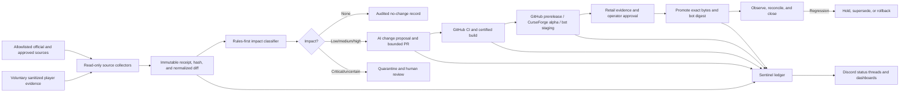

# KnoMercy War Room Continuous Maintenance Automation Plan

**Status:** Proposed architecture; no production automation is enabled by this document  
**Last revised:** 2026-07-14  
**Operating timezone:** `America/Chicago`  
**Primary Discord:** [KWR Discord](https://discord.gg/6SHp9qAef)  
**Repositories:** `josevargas6/KnomercyWarRoom` and `josevargas6/kwr-sentinel-bot`

> In this plan, **biweekly** means once every 14 days. If the intended cadence is twice per week, only the trend schedule changes; the controls and release gates remain the same.

## 1. Executive decision

Establish **Sentinel Maintenance Control Plane** as an external automation system around three separately versioned products:

1. **KnoMercy War Room addon** — strategy, assignments, map intelligence, combat analysis, and commander UI.
2. **KWRSentinel in-game companion addon** — local same-client verification and evidence capture.
3. **KWR Sentinel Discord bot/control plane** — source monitoring, workflow coordination, Discord reporting, release status, and guarded operator actions.

GitHub remains the source of truth. Discord is the operator console, notification surface, and voluntary evidence intake. Render runs the Discord bot and maintenance workers. GitHub Actions performs deterministic validation, packaging, publishing, and deployment. CurseForge distributes approved addon builds.

The virtual AI may discover, classify, propose, edit bounded branches, run tests, and prepare releases. It must not silently change strategic truth, merge its own code, publish stable builds, rotate credentials, or perform in-game actions.

### Non-negotiable constraints

- A WoW addon cannot perform arbitrary HTTP requests. The installed addon must remain functional without Sentinel or any external service.
- The Discord bot cannot overwrite a player's live `Interface/AddOns` directory. Addon updates reach players through CurseForge or a manually downloaded GitHub release.
- `KWRSentinel/` is an in-game addon, not the Discord bot. Cross-player addon messaging described in `SENTINEL_TRANSPORT_SPEC.md` remains a separate design-gated feature.
- Player evidence is voluntary and user-triggered. Redact identifiers and never automate gameplay from Discord, AI, or server output.
- Blizzard's Tuesday maintenance is a monitoring checkpoint, not proof that every hotfix has been published or activated. Monitoring continues after 9:00 AM and on non-patch days.
- Never infer `reviewed=true`, advance `officialHotfixReviewed`, or alter strategic weights solely because a page parser or language model produced a result.

## 2. Current baseline and activation gaps

| Area | Current state | Required next state |
|---|---|---|
| Addon CI | `ci.yml` validates, audits, smoke-tests, soak-tests, builds, and uploads artifacts | Pin tool versions/actions, add change receipts, reusable certified-build workflow, concurrency, and security checks |
| Addon release | `release.yml` creates a GitHub prerelease from a `v*` tag | Separate candidate and promotion; publish the exact certified bytes to GitHub and CurseForge; no rebuild during promotion |
| Packaging | `tools/build.ps1` produces distribution, developer, and KWRSentinel ZIPs plus hashes/provenance | Make its manifest the release contract and record all external publication IDs |
| Knowledge | Reviewed patch template, patch data, source registry, audit, freshness score | Separate `observedThrough` from `reviewedThrough`; retain source revisions and machine-readable impact decisions |
| Release readiness | Alpha/live-client evidence is still incomplete | Stable promotion remains blocked until documented Retail proof is attached |
| Git branches | Remote default is `main`; project instructions require PRs to `develop` | Verify or create/protect `develop`, then codify `develop -> main -> release` before autonomous PR creation |
| Sentinel bot | Discord Gateway bot, slash commands, GitHub issue creation, AI help, Docker worker, graceful shutdown | Add durable scheduler/ledger, parser tests, queueing, redaction, monitoring, release commands, and staged deployments |
| Bot CI | Syntax-oriented `npm run smoke` | Add lint, unit/integration tests, dependency audit, config validation, container scan, and staging smoke tests |
| Render | Docker Background Worker; production currently follows passing checks | Keep staging automatic, make production an explicit approved exact-commit/digest deployment, add application-level heartbeat monitoring |
| Discord | Existing KWR channels and commands cover help, reports, strategy, and weekly intel | Add operator-only maintenance commands, one audit thread per change, role checks, and immutable GitHub links |
| CurseForge | Addon page URL is documented | Confirm the project ID, author API token, supported game-version IDs, ownership, and release-channel policy before activation |
| Secrets | Environment-dependent and not fully re-audited | Inventory, rotate where needed, scope by environment, move GitHub access to an App, and test revocation |

The last recorded bot configuration was safe for Discord-only use; GitHub issue sync and AI were disabled by default in `render.yaml`. Phase 0 must inspect the live Render service rather than assuming later setup instructions were applied.

## 3. Target architecture



### Runtime components

- **Sentinel worker on Render:** Discord Gateway connection, schedules, outbound source polling, queue processing, and status publication.
- **Durable state store:** Render Postgres or Key Value for leases, deduplication, heartbeats, release state, retry state, and audit references. Never depend on a worker's ephemeral filesystem.
- **GitHub Actions:** trusted build and deployment executor. PR jobs have no production secrets. Protected release jobs receive only the secret required for that environment.
- **Optional Sentinel control web service:** add only when signed GitHub/Render webhooks and public readiness are worth the extra service. Initial operation can use outbound polling.
- **Discord:** human-facing console. Every action links back to a GitHub issue, PR, workflow run, release, or immutable receipt.

## 4. Authoritative state model

Every discovered change receives a stable `changeId` and advances through an idempotent state machine:

```text
DISCOVERED -> NORMALIZED -> TRIAGED -> NO_IMPACT
                                 \-> PR_DRAFTED -> REVIEWED -> CI_CERTIFIED
                                    -> STAGED -> LIVE_CERTIFIED -> APPROVED
                                    -> PROMOTED -> OBSERVING -> CLOSED

Any state -> QUARANTINED
STAGED or PROMOTED -> HELD -> ROLLED_BACK or SUPERSEDED
```

Duplicate schedules, edited Blizzard notes, Discord retries, or rerun workflows must resolve to the same `changeId`, receipt revision, and intended state transition. A database transaction or lease prevents two workers from publishing the same event.

### Change record contract

Each record contains:

- `changeId`, source type, canonical URL, observed/published/updated timestamps, ETag or Last-Modified when available, and content hash;
- source revision and prior revision hash so later edits to patch notes remain visible;
- Retail patch, season, interface number, region, and applicability window;
- normalized factual claims with short supporting evidence, never an entire copied page;
- affected product, modules, data tables, saved-variable schema, protocol, tests, and release notes;
- severity, confidence, ambiguity flags, and why the change does or does not affect KWR;
- issue, branch, PR, commit, workflow run, tag, artifact hashes, bot image/commit, and CurseForge file IDs;
- approvals, Retail evidence, staged observations, promotion time, and last-known-good rollback target.

Store source metadata under a new `knowledge/receipts/` hierarchy. Keep reviewed strategic truth in the existing `Data/` and `knowledge/` structures. This prevents “observed” from being confused with “reviewed.”

## 5. Source policy and intake

### Tier 1 — authoritative automation inputs

- Blizzard content-update and hotfix notes;
- Blizzard developer/game-data documentation when it is relevant to supported APIs;
- KWR and Sentinel GitHub repositories, workflow results, dependency advisories, and releases;
- CurseForge upload/file status APIs for KWR-owned projects;
- Render deploy/service status and application heartbeats.

Tier 1 sources may create a receipt and candidate PR. They still cannot self-certify strategic correctness.

### Tier 2 — advisory signals

- permitted/licensed community meta sources already cited by KWR;
- sanitized, opt-in `/kwr verify`, `/kwr bug`, diagnostics, AAR, Discord strategy, and test-build submissions;
- repeated support issues, field reports, and commander feedback.

Tier 2 data creates a hypothesis, investigation, fixture, or test-build request. It never directly rewrites doctrine, objective weights, map truth, or player guidance. Do not scrape a community source unless its terms and access method permit it.

### Collection behavior

1. Fetch only an allowlisted HTTPS host and path with strict size/time limits.
2. Save metadata, hash, relevant normalized sections, and a short legally appropriate excerpt or paraphrase.
3. Compare against the last known revision.
4. Run deterministic keyword/schema rules before invoking AI.
5. Give AI only bounded extracted data and the repository impact map. Treat all web and Discord text as untrusted data, never as instructions.
6. Validate AI output against a JSON schema and path allowlist.
7. Create a no-impact record, an investigation, or a candidate PR.
8. Post one concise Discord thread update and update it as the same record advances.

Parser failures fail closed: retain the raw hash and alert `#addon-api-watch` or `#intel-review`; do not treat an empty parse as “no change.”

## 6. Impact map and risk gates

| Change type | Primary KWR paths | Default risk | Required proof |
|---|---|---:|---|
| Interface/API/deprecation/taint | TOCs, `Adapters/`, `Compliance/`, `Runtime/Sensors/`, `Rulesets/`, tests | Critical/high | API fixture, forbidden-API scan, CI, Retail load/taint proof, safe fallback |
| Battleground objectives, scoring, timers, or map rules | `Data/Maps/`, objective rules/weights, strategist, predictor, assignments, map tests | High | Official evidence, deterministic scenario tests, field certification on affected map |
| PvP tuning, spells, cooldowns, or capabilities | `Data/PatchData.lua`, capabilities, combat spells, counters, tests | Medium/high | Spell/data diff, counter review, deterministic tests, live verification when calls change |
| Meta/ranking shift | `Data/MetaSnapshot.lua`, `META_SOURCES.md`, doctrine hypotheses | Medium/advisory | Permitted source, sample/context disclosure, human review; no automatic doctrine change |
| Bot command or AI response behavior | `kwr-sentinel-bot/src`, command schema, privacy/legal docs, bot tests | Medium/high | Unit/integration tests, staging guild smoke test, redaction/security review |
| Docs/source receipt only | `docs/`, `knowledge/receipts/` | Low | Link/hash validation and normal CI |
| No KWR impact | Ledger only | None | Recorded reason and source revision; no version bump or empty release |

### Automation authority by risk

| Risk | AI may do | Human gate |
|---|---|---|
| None | Record, summarize, close | Periodic audit only |
| Low | Open/update a PR; optionally auto-merge receipt-only changes after a successful trial period | CODEOWNERS rule and rollback path |
| Medium | Open a draft PR, add fixtures/tests, build an alpha candidate | Maintainer review before merge; operator approval before beta/stable |
| High | Prepare investigation and draft patch on an isolated branch | Domain review, CI, live Retail certification, release approval |
| Critical or ambiguous | Quarantine, alert, propose safe-mode steps | Security/architecture review; no unattended merge or release |

Initially, all AI-created PRs require review. Receipt-only auto-merge can be considered only after at least four weeks of clean audited operation.

## 7. Virtual AI workgroup

Use narrow agents with non-overlapping authority rather than one all-powerful bot.

| Agent | Responsibility | Permitted write surface | Explicitly forbidden |
|---|---|---|---|
| Watcher | Poll allowlisted sources and create receipts | Receipt queue only | Repository writes, secrets, release actions |
| Normalizer | Extract factual deltas and revisions | Normalized receipt fields | Interpreting strategy or changing code |
| Triage analyst | Apply impact/risk taxonomy and open an investigation | Issue/ledger/Discord status | Claiming review completion |
| Impact mapper | Map facts to current modules, tests, and owners | PR plan/checklist | Broad refactors without scoped approval |
| Patch author | Produce minimal code/data/test changes | `sentinel/<changeId>-*` branch and allowlisted paths | `main`, secrets, workflows, branch rules, self-merge |
| Verifier | Run deterministic checks and compare evidence | Check results and annotations | Deployment credentials or overriding failures |
| Release manager | Promote an already certified digest | Protected release workflow inputs | Rebuilding artifacts or approving itself |
| Observer | Monitor bot, GitHub, CurseForge, and field evidence | Incident/hold/rollback request | Inventing player telemetry or auto-downgrading clients |
| Discord reporter | Publish concise state changes and accept role-checked requests | Existing change thread | Treating a Discord reaction as a production approval |

AI tools receive no Discord token, CurseForge token, Render deploy secret, GitHub admin permission, or production database credential. A deterministic workflow—not the model—checks approvals and executes external mutations.

## 8. Operating cadence

The Render worker is the primary scheduler. GitHub Actions is an independent fallback for critical read-only scans. Both use `America/Chicago`, a shared lease, and the `changeId` deduplication rule. Jobs avoid minute `00`, when scheduled CI queues are more likely to be congested.

| Time | Job | Output |
|---|---|---|
| Monday 16:30 | Patch-day preflight | Source reachability, credentials by capability, CI health, last-known-good manifest, Render/Discord readiness |
| Tuesday 08:47 | Baseline snapshot | “Patch watch active” briefing in Discord; hashes current sources and records active KWR versions |
| Tuesday 09:07–14:52, every 15 minutes | High-frequency patch watch | New/edited hotfix receipts, API/build signals, triage, incident alerts |
| Tuesday 15:17–Wednesday 12:17, hourly | Extended reconciliation | Captures delayed or edited notes and CurseForge/Render state changes |
| Daily 10:17 and 16:17 | Normal hotfix watch | Non-Tuesday hotfixes, advisories, service and dependency changes |
| Wednesday 13:17 | Patch-cycle reconciliation | Account for every receipt, open PR, failed check, release, and no-impact decision |
| Every other Thursday 10:17 | Fourteen-day trends | Compare last 14 days with previous 14 days, plus 4- and 8-week context |
| Monthly | Security/maintenance train | Pinned dependency updates, credential age audit, restore test, stale workflow/channel cleanup |
| Quarterly | Recovery exercise | Rehearse bot rollback, release supersession, database restore, Discord outage procedure |

Run the trend job every Thursday and use a persisted anchor date/week parity to decide whether it is the active fortnight; cron alone should not attempt to model “every two weeks.”

### Patch-day response targets

- Detection: p95 under 15 minutes during the Tuesday watch window; under 4 hours otherwise.
- Discord impact briefing: within 20 minutes of a valid detected revision.
- Low/medium candidate PR: target under 60 minutes when deterministic mapping exists.
- Bot staging deployment: target under 15 minutes after an approved merge.
- Bot rollback: target under 10 minutes after a confirmed staging/production failure.
- Stable release: no time promise; correctness, Retail proof, exact-artifact integrity, and approvals take precedence.

## 9. GitHub workflow design

### Addon repository

Add these workflows incrementally:

1. **`source-watch.yml`** — fallback read-only scheduled collector and manual dispatch; creates a receipt issue or commits only through a reviewed automation PR.
2. **`automation-pr.yml`** — validates a structured change record, checks edit-path policy, creates/updates one draft PR against `develop`, and prevents duplicate branches.
3. **Reusable certified CI/build** — refactor the existing checks without weakening them. Required order:
   - architecture/TOC/safety validation;
   - knowledge audit;
   - deterministic smoke and soak tests;
   - new parser/manifest/migration/security tests;
   - `tools/build.ps1` and package audit;
   - source manifest, build provenance, checksums, and optional signing/attestation;
   - upload immutable artifacts with retention long enough for the full release train.
4. **`candidate-release.yml`** — after approved merge/tag, publishes the certified distribution ZIP to GitHub prerelease and the appropriate CurseForge alpha/beta channel; deploys the bot only if that separate repo has a compatible release.
5. **`promote-release.yml`** — downloads and hash-verifies the already certified artifact. It never invokes a rebuild. It publishes GitHub stable/CurseForge release and records external IDs.
6. **`rollback.yml`** — operator-dispatched incident workflow that holds announcements, restores bot last-known-good, and prepares a higher-version addon superseding release.
7. **`biweekly-trends.yml`** — assembles sanitised operational data and creates a report/issue; it cannot edit strategy code.

Use workflow concurrency keyed by `changeId`, version, or environment. Cancel stale candidate runs, but never cancel an active production promotion halfway through an external publication.

### Bot repository

Strengthen the current bot pipeline before it is allowed to coordinate production:

- pin Node and package-manager behavior; retain lockfile-only installs;
- lint and type/schema-check JavaScript configuration;
- add unit tests for permissions, redaction, issue payloads, state transitions, retry/backoff, and source parsers;
- add Discord API mocks and GitHub/CurseForge/Render contract tests;
- test command registration separately from normal startup;
- run `npm audit` or an equivalent advisory gate with an explicit severity policy;
- scan the container and verify it runs as a non-root user;
- publish a bot version and immutable image/commit identity;
- deploy to a staging guild/service, run command and heartbeat smoke tests, then require production approval;
- verify graceful `SIGTERM`, lease handoff, and no duplicate Discord responses during a Render rollout.

### Branch and environment policy

- Automation branches: `sentinel/<changeId>-<short-description>`.
- Normal PR target: protected `develop`, as required by the project guidelines.
- Promotion PR: `develop` to protected `main` after candidate certification.
- Releases: immutable `v*` tag from the approved `main` commit.
- Protected environments: `github-prerelease`, `curseforge-alpha`, `bot-staging`, `curseforge-production`, and `bot-production`.
- Production requires a maintainer who did not author the automated change. Environment secrets are unavailable until the gate passes.

GitHub plan features for protected environments must be verified because both repositories are private. If required reviewers are unavailable on the current plan, use protected branches, CODEOWNERS review, a maintainer-only `workflow_dispatch`, and a workflow check that verifies the approved PR and exact commit. Discord remains informational, never the sole approval authority.

### Release manifest

Create one machine-readable release-train record, for example `automation/release-train.json`:

```json
{
  "changeId": "blizzard-2026-07-14-hotfix-r2",
  "channel": "alpha",
  "retailPatch": "12.0.7",
  "interface": 120007,
  "addon": { "version": "6.1.0-alpha.26", "artifactSha256": "..." },
  "sentinelAddon": { "version": "6.1.0-alpha.26", "artifactSha256": "..." },
  "sentinelBot": { "version": "0.2.0", "commit": "...", "imageDigest": "..." },
  "savedVariablesSchema": 1,
  "addonProtocol": 0,
  "discordCommandSchema": 1,
  "rollbackManifest": "..."
}
```

The exact schema is finalized during implementation. Do not increase a saved-variable or protocol version unless a real migration/compatibility change exists. Generate duplicated version/interface strings from this source where practical and extend `validate.ps1` to detect parity drift across TOCs, Lua, diagnostics, and release documentation.

## 10. CurseForge release automation

### One-time prerequisites

- Confirm KWR's CurseForge project ID and that the current owner can upload through the author API.
- Create a narrowly scoped API token and store it only in GitHub's protected CurseForge environments.
- Resolve supported Retail game-version IDs/names and validate them against the current interface build.
- Decide whether the separate in-game `KWRSentinel` package has its own approved CurseForge project. If not, distribute it only by the explicitly documented route.
- Record project IDs as non-secret configuration; never log or expose the token.

### Publication rules

- Upload only `KWR_<version>_DISTRIBUTION.zip` to the KWR project.
- Never upload the developer archive or the Discord bot to CurseForge.
- Upload KWRSentinel only to a separate approved project and only from its dedicated archive.
- Channel mapping: candidate -> `alpha`, field-certified candidate -> `beta`, approved promotion -> `release`.
- Include generated changelog, supported game versions, release type, source commit, and checksum in the release record.
- Treat a successful upload request as **submitted**, not published. Poll the file API until it is available/approved or rejected, with bounded exponential backoff.
- Announce a public CurseForge release only after availability is verified.
- On a bad addon release, archive/demote when supported and publish a tested higher-version superseding build. Never rewrite tags or pretend an installed client can be remotely downgraded.

## 11. Sentinel Discord operating surface

Reuse the server's existing channel structure rather than creating a duplicate operations server:

| Event | Primary channel |
|---|---|
| Meta source changes | `#meta-watch` |
| Blizzard/UI API changes | `#addon-api-watch` |
| Map/objective research | `#map-tech-watch` |
| Triage and human review | `#intel-review` |
| Candidate artifacts | `#test-builds` |
| Required Retail sessions | `#testing-calls` |
| Stable release | `#announcements` |
| Approval/audit/security events | restricted `#mod-log` |
| User diagnostics and Bugsack evidence | `#diagnostics` and `#bugsack-errors` |

Create one Discord thread per `changeId`; update the original status message instead of spraying duplicate posts. Every post includes severity, confidence, affected modules, current state, GitHub link, required human action, and next scheduled check.

### Proposed operator commands

- `/sentinel status [change|release]` — current versions, source freshness, CI, CurseForge, and Render state.
- `/sentinel sources` — last successful and failed observations without dumping page content.
- `/sentinel change <id>` — evidence, impact map, PR, tests, approvals, and blockers.
- `/sentinel candidate <id>` — request a candidate workflow; returns a GitHub run link.
- `/sentinel release-request <version>` — create a protected GitHub promotion request; does not publish directly.
- `/sentinel hold <changeId> <reason>` — freeze further promotion and open an incident.
- `/sentinel rollback-request <release> <reason>` — create a protected rollback workflow request.
- `/sentinel trends [14d|28d|56d]` — render the latest sanitized trend report.

Commands are role-checked against explicit guild/role configuration, use Discord interaction acknowledgements within required deadlines, and are idempotent. High-impact commands require a reason and an existing GitHub record. The bot never accepts a generic reaction emoji as approval.

Retain existing public/support commands such as `/download`, `/install`, `/aar`, `/diag`, `/bug`, `/strat`, and `/suggest`. Add upload size/type checks, malware-safe handling, redaction, retention/deletion controls, and a clear confirmation before voluntary content is sent to GitHub or AI.

## 12. Render bot/server deployment and health

The current service is a Render Background Worker. Its local `/healthz` and Docker `HEALTHCHECK` are useful diagnostics, but Render application health checks do not monitor Background Workers the way they monitor web/private services. Do not mark a deploy healthy solely because the container started.

### Required deployment model

1. Create separate staging and production worker services or equivalent isolated environments.
2. Allow staging to deploy after bot CI passes.
3. Disable implicit production auto-deployment from every passing `main` commit.
4. Have the protected GitHub production workflow request a Render deploy for an exact commit or immutable image digest.
5. Poll Render deployment state, then run Discord command-registration, heartbeat, GitHub connectivity, and queue-processing smoke tests.
6. Record deploy ID, commit/digest, timestamps, smoke results, and previous deploy in the release manifest.
7. Promote announcement only after the bot remains healthy through the observation window.

### Application-level liveness

- Worker writes a heartbeat and queue watermark to durable storage at least once per minute.
- Sentinel posts or updates a compact heartbeat in restricted operations Discord without noisy per-minute messages.
- An independent scheduled monitor checks Render deploy/service state plus heartbeat age.
- Add a minimal Render web/private control service later if signed webhook intake and a health endpoint backed by the worker heartbeat are required.
- Alert on stale heartbeat, restart loop, command registration failure, Discord disconnect beyond threshold, queue age, GitHub/CurseForge authentication failure, or repeated API rate limiting.

Until four weeks of baseline data exists, use hard failure triggers rather than invented percentage thresholds: startup/registration failure, three consecutive failed heartbeat checks, unrecoverable migration failure, or inability to process a known canary command. Establish rate/error thresholds from measured staging and production behavior.

## 13. Release train and compatibility

### Candidate

A candidate requires:

- immutable source receipt and impact decision;
- minimal code/data/test PR with owner review;
- every existing validator/audit/smoke/soak/build/package check passing;
- changelog, compatibility statement, migration statement, and rollback target;
- certified artifact hashes and bot commit/image identity;
- GitHub prerelease plus CurseForge alpha submission when applicable;
- test-build Discord thread and explicit Retail test instructions.

### Beta

Beta requires affected-map or affected-runtime evidence, no new startup/Lua/taint regression, bounded performance, known limitations, and a verified available CurseForge beta file.

### Stable

Stable requires the repository's release-readiness gates, protected approval, exact-artifact verification, compatible bot/server staging, completed rollback manifest, and a post-release observation owner. Stable promotion reuses the candidate bytes; it does not rebuild from source.

### Compatibility sequencing

- Prefer additive bot/API changes with at least N/N-1 compatibility.
- Deploy server support first, verify staging/canary, then publish addon behavior that depends on it.
- Never make core RBG guidance dependent on Sentinel availability.
- Use expand/migrate/contract database changes so the previous bot can run during rollback.
- If an unknown interface/API change threatens safety, create a strict/safe-mode candidate and alert users; do not fabricate compatibility.

## 14. Biweekly trend system

### Inputs

- official change/hotfix receipts and time-to-triage;
- CI results, duration, flaky checks, package audit, and dependency/security alerts;
- sanitized opt-in verification, AAR, bug, and diagnostic evidence grouped by KWR version;
- map certification/sample coverage and stale/unknown runtime fields;
- bot command latency, errors, rate limiting, queue depth, restarts, and release identity;
- CurseForge file availability and adoption/download signals where the API and privacy policy permit;
- permitted community meta signals, clearly labeled advisory.

### Report

Compare the latest 14 days with the prior 14 days, and show 4- and 8-week context for:

- Lua/startup/taint issue clusters by version and module;
- p95 runtime refresh cost and soak-test deltas;
- stale/unknown knowledge and resolver rates;
- map evidence coverage and commander call/prediction error where outcomes are known;
- patch detection, triage, PR, certification, and release lead time;
- bot uptime/heartbeat gaps, command latency, API 429s, and failures;
- adoption lag and support volume after each release;
- recurring manual work suitable for the next automation improvement.

Every chart/table includes sample size, missingness, source, collection window, and confidence. Suppress small cohorts and direct identifiers; establish a minimum aggregation threshold before publishing player-derived data. Biased or sparse data is labeled, not “smoothed” into certainty.

Trend output opens a hypothesis, data-quality issue, fixture request, or roadmap proposal. It never changes doctrine or weights automatically.

## 15. Security, privacy, and supply-chain controls

- Replace long-lived GitHub PAT access with a narrowly scoped GitHub App. The support bot normally needs metadata/content read and issues read/write only. Use a separate installation or ephemeral workflow token for branch/PR creation.
- No AI component receives merge, tag, Actions workflow, environment, secret, Render deploy, CurseForge publish, or repository-admin permission.
- Pin third-party GitHub Actions to reviewed commit SHAs and automate update PRs.
- Pin Fengari/Node/npm behavior; verify lockfiles and dependency provenance.
- Enable dependency review, secret scanning where available, and custom patterns for Discord, CurseForge, Render, GitHub App, and OpenAI secrets.
- Never use `pull_request_target` to execute untrusted PR code with secrets.
- Release jobs run only trusted commits, with minimal `permissions`, protected environments, and per-environment credentials.
- Egress allowlists cover only Blizzard, GitHub, Discord, CurseForge, Render, approved AI, and explicitly approved meta hosts.
- Validate redirects, DNS/host boundaries, MIME type, archive paths, attachment size, and content before processing.
- Treat source pages, issue bodies, Discord messages, logs, and attachments as prompt-injection-capable untrusted data.
- Redact BattleTags, character/realm names, Discord identifiers, tokens, local paths, and diagnostic secrets before durable storage or AI use.
- Implement retention and deletion, not only policy text. Keep release/audit records longer than raw user evidence.
- Log actor, requested action, exact commit/artifact, environment, result, and rollback target without logging secrets.
- Test credential revocation, rotation, and least-privilege failure during the quarterly exercise.
- Follow Blizzard's addon policy and never automate protected actions, gameplay inputs, or paid/premium in-game capability.

## 16. Failure and rollback design

| Failure | Automatic response | Human response |
|---|---|---|
| Source layout/parser change | Quarantine receipt, retain hash, stop downstream changes | Update fixture/parser and re-review delta |
| Blizzard edits an existing hotfix note | Create a new receipt revision; dedupe unchanged sections | Reassess affected candidate/release |
| Scheduler delay/outage | Secondary scheduler attempts the same leased job | Review missed-window report |
| AI returns malformed/unsafe edit | Schema/path policy rejects it; no branch update | Inspect prompt/data and improve fixture |
| CI passes offline but Retail fails | Hold promotion and mark candidate live-failed | Attach `/kwr verify`/bug evidence and patch |
| CurseForge upload under review | Keep GitHub candidate available; poll with backoff | Announce only after approval or explain delay |
| Bot deploy fails | Keep/restore last-known-good exact commit/digest | Review logs/migration and approve retry |
| Discord unavailable | Continue ledger/GitHub processing; queue bounded updates | Reconcile one summary after recovery |
| Bad addon stable release | Hold announcements, archive/demote if possible, prepare higher-version superseding build | Approve tested superseding release; never rewrite history |
| Database migration breaks bot | Stop new worker, restore compatible app/database state | Use backup and expand/contract recovery runbook |
| Strategic trend is biased/sparse | Suppress automated recommendation | Gather evidence or close as inconclusive |

Maintain `stable-manifest.json` with the last-known-good addon artifact hashes, GitHub commit/tag, CurseForge file IDs, bot commit/image digest, database migration level, protocol/schema versions, and restoration instructions.

## 17. Observability and audit

Minimum dashboards/status surfaces:

- source freshness and parser success by source;
- open changes by state, severity, age, and owner;
- CI pass/fail/duration and artifact identity;
- candidate/stable version matrix across GitHub, CurseForge, addon TOCs, Lua, and bot;
- Render deploy, heartbeat age, queue lag, command errors, and API rate limits;
- live Retail evidence coverage and unresolved release gates;
- credential capability check without exposing secret values;
- latest backup/restore and rollback drill status.

Every Tuesday reconciliation produces an audit summary even when there was no impact. A no-change week creates a signed/hashed no-change record; it does not create an empty release or bump a version.

## 18. Phased implementation backlog

### Phase 0 — inventory and safety boundary (2–3 engineering days)

- Verify/create `develop`, branch protection, CODEOWNERS, release maintainers, and GitHub plan capabilities.
- Audit live Render Blueprint/service/environment values; rotate uncertain credentials.
- Confirm CurseForge project ownership, IDs, token, game-version mapping, and moderation behavior.
- Create staging Discord guild/channels or an isolated staging role/channel set.
- Document the three product/version boundaries and select the durable state service.
- Capture last-known-good addon/bot state and perform a manual rollback dry run.

**Exit:** credential matrix, owners, environments, branch flow, staging surfaces, and rollback target are verified. No AI publishing authority exists.

### Phase 1 — read-only watch and audit (1–2 weeks)

- Implement receipt schema, allowlisted collectors, revision hashes, durable leases, and state ledger.
- Add Tuesday/daily schedules, no-impact records, Discord change threads, parser fixtures, and failure alerts.
- Add heartbeat persistence and independent Render monitoring.
- Run in shadow mode; compare every result with manual review.

**Exit:** two patch cycles or equivalent test fixtures complete with no missed/duplicate receipts and no repository/release writes.

### Phase 2 — guarded PR automation (about 2 weeks)

- Add rules-first impact classification, bounded AI triage, path policy, draft PR creation, and reviewer routing.
- Add release manifest/version parity validation and missing deterministic tests.
- Strengthen addon and bot CI; pin supply-chain dependencies/actions.
- Keep all AI PRs human-reviewed.

**Exit:** representative no-impact, docs, PvP-tuning, map-rule, API-breaking, edited-note, and prompt-injection fixtures pass end to end.

### Phase 3 — candidate and staging automation (about 2 weeks)

- Build once, retain hashes/provenance, create GitHub prereleases, and submit CurseForge alpha files.
- Add staging Render deployment by exact bot commit/image and Discord canary smoke tests.
- Add protected environment gates and publication status polling.
- Connect test-build/testing-call threads to explicit `/kwr verify` evidence checklists.

**Exit:** a non-production rehearsal publishes and verifies the same artifact across all candidate surfaces and successfully rolls back the bot.

### Phase 4 — guarded production and recovery (about 2 weeks)

- Enable maintainer-approved stable promotion, CurseForge availability verification, Render production deployment, announcements, and observation windows.
- Implement stable manifest, bot rollback, addon superseding-release runbook, database backup/restore, and incident commands.
- Exercise Discord, CurseForge, GitHub Actions, source parser, and Render failure scenarios.

**Exit:** an operator can halt or recover every external mutation without direct secret handling or tag/history rewriting.

### Phase 5 — fourteen-day trends (about 2 weeks)

- Establish privacy-safe schemas, minimum sample rules, 14/28/56-day comparisons, data-quality scoring, and report generation.
- Review four weeks of baseline before defining rate-based alert thresholds.
- Route findings to evidence-backed issues, tests, and roadmap items.

**Exit:** two reviewed trend reports correctly distinguish observed fact, hypothesis, missing data, and recommended work.

### Phase 6 — continuous hardening

- Monthly dependency/security trains, quarterly recovery exercises, source/parser fixture maintenance, cost/rate-limit review, and removal of unused permissions.
- Consider receipt-only auto-merge only after measured reliability; never extend it to strategic or production changes without a new design review.

## 19. Definition of done for the automation program

The system is production-ready when:

- every source event is deduplicated, revisioned, attributable, and recoverable;
- AI cannot merge, approve, tag, publish, deploy, access production secrets, or change strategic truth without deterministic checks and required human gates;
- addon, in-game Sentinel, and Discord bot versions/protocols are separately tracked and compatibility-tested;
- existing validation, knowledge audit, smoke, soak, build, and package audit remain mandatory;
- candidate and stable paths reuse identical verified artifacts;
- CurseForge publication is status-verified before announcement;
- Render production deploys an exact approved identity and has real application heartbeat monitoring;
- live Retail evidence remains a stable-release gate for changes that affect performance or commander logic;
- no-change, failure, hold, rollback, and superseding-release paths have all been rehearsed;
- Discord shows concise status and links to the authoritative GitHub/audit record;
- privacy deletion, credential rotation, database restore, and incident ownership are implemented and tested.

## 20. Immediate implementation order

1. Complete Phase 0 and resolve the `develop`/`main`, CurseForge project, live Render configuration, and staging-environment facts.
2. Implement only the read-only receipt/ledger/scheduler/Discord status path.
3. Observe it through at least one real Tuesday plus fixture replay before granting branch-write permission.
4. Strengthen both repositories' CI and release-manifest parity.
5. Add draft-PR automation, then candidate publishing, then bot staging.
6. Enable protected stable promotion only after a full release-and-rollback rehearsal.
7. Add biweekly trend recommendations last, once collection quality and privacy thresholds are measurable.

## 21. Authoritative references

- [Blizzard content update notes](https://worldofwarcraft.blizzard.com/en-us/content-update-notes)
- [Blizzard UI Add-On Development Policy](https://us.forums.blizzard.com/en/wow/t/ui-add-on-development-policy/24534/1)
- [Battle.net World of Warcraft game-data documentation](https://community.developer.battle.net/documentation/world-of-warcraft/game-data-apis)
- [GitHub scheduled workflow events](https://docs.github.com/en/actions/reference/workflows-and-actions/events-that-trigger-workflows)
- [GitHub protected deployment environments](https://docs.github.com/en/actions/reference/workflows-and-actions/deployments-and-environments)
- [GitHub App security practices](https://docs.github.com/en/apps/creating-github-apps/about-creating-github-apps/best-practices-for-creating-a-github-app)
- [GitHub Actions concurrency](https://docs.github.com/en/actions/concepts/workflows-and-actions/concurrency)
- [CurseForge addon upload API](https://support.curseforge.com/support/solutions/articles/9000197321)
- [CurseForge project/file statuses](https://support.curseforge.com/support/solutions/articles/9000197905-project-statuses-101)
- [CurseForge Core file API](https://docs.curseforge.com/rest-api/)
- [Discord interactions](https://docs.discord.com/developers/interactions/receiving-and-responding)
- [Discord Gateway](https://docs.discord.com/developers/events/gateway)
- [Discord rate limits](https://docs.discord.com/developers/topics/rate-limits)
- [Render Background Workers](https://render.com/docs/background-workers)
- [Render deploys and deploy hooks](https://render.com/docs/deploys)
- [Render health checks](https://render.com/docs/health-checks)
- [Render API](https://render.com/docs/api)

