# KWR Commander Gap Closure Design Path

Date: 2026-07-15  
Current verdict: `CURRENT_STATE_PARTIAL`  
Architecture direction: `BUILD_WITH_LOCAL_REFACTOR`  
Target: 9.2/10 architecture before visual validation; 9.7-10/10 only after live RBG proof.

## Strategic Answer

The safest and fastest order is:

1. Freeze and characterize the working macro pipeline and current replay behavior.
2. Introduce a read-only BoardState compatibility contract over existing snapshot truth.
3. Define the ruleset-owned decision policy needed by every later scorer.
4. Expand enemy problems and counterplay as data before changing assignment selection.
5. Replace greedy assignment with a bounded, deterministic optimizer.
6. Make kill selection consume the resolved control assignments.
7. Improve DR, CC, and mobility confidence only through safe facts.
8. Standardize reasons and suppression evidence.
9. Integrate the local plan as a subordinate tactical plan, then run the complete replay/performance matrix.
10. Wire and validate the existing presenter modules in live RBG UI.

This order protects the working `Sensors -> Reporter -> Strategist -> Commander -> ActivePlay`
pipeline. BoardState is introduced as a view, not a new truth authority. The optimizer is not
written until its inputs, problem meanings, and policy thresholds are stable. Kill selection
comes after assignments because healer-control coverage changes kill feasibility. Live UI comes
last because the current presenter modules are tested builders but are not yet production
consumers of `snapshot.teamfight`.

Two corrections to the requested phase order are required:

- Ruleset schema and confidence policy must be established with BoardState. The broad migration
  of remaining assumptions can still finish later.
- Tests cannot wait until Phase 9. Every phase needs characterization and deterministic tests;
  Phase 9 is the consolidated certification pass.

## 1. Executive Verdict

KWR should not be rebuilt. Its macro commander, map doctrine, evidence reconciliation,
assignment engine, AAR, verification, and ActivePlay stability are assets. The local teamfight
slice is a separate, narrow capability currently built from `FactStore`,
`LocalTeamfightState`, `EnemyProblemDetector`, `AssignmentScorer`, a greedy
`AssignmentOptimizer`, and `KillTargetSelector`.

Current proof is meaningful but limited:

- The Knomercy/Stan/two-healer/Warrior replay works offline.
- Target assist is display-only and forbidden action APIs are validated.
- UNKNOWN paths exist and do not crash the tested presenter builders.
- The macro commander already has candidate persistence, switch cost, invalidation, suppression,
  and churn metrics.
- The local planner is computed in `Runtime/MatchRuntime.lua` and stored, but its dedicated UI
  presenters are only consumed by tests. It is not yet a complete live product path.

The architecture can reach 9.2 without destabilizing the macro commander if local intelligence
is built as a bounded tactical subsystem with one-way dependencies:

```text
Existing safe snapshot truth
    -> FactStore
    -> BoardState compatibility view
    -> Enemy problems
    -> Counterplay candidates
    -> Bounded assignment optimization
    -> Context-aware kill selection
    -> TacticalPlan
    -> Commander arbitration / existing UI presenters
```

The macro Commander remains the sole strategic authority. TacticalPlan can enrich the current
command and personal target guidance; it cannot independently redirect objective assignments or
bypass ActivePlay stability.

## 2. Gap Closure Strategy

### Preserve

- `Runtime/Sensors.lua` as the live Blizzard-data collector and evidence reconciler.
- `Runtime/Reporter.lua` as battlefield movement and temporal awareness.
- `Runtime/Strategist.lua` as macro strategy selection.
- `Runtime/Assignments.lua` as strategic map-role assignment authority.
- `Runtime/Commander.lua` and ActivePlay as publication/stability authority.
- Existing Store API, saved variables, visibility policy, AAR, and verification paths.
- Existing compliance adapters, forbidden API validator, smoke suite, and soak suite.

### Build locally

- A read-only BoardState contract for normalized tactical consumption.
- A complete, bounded enemy-problem taxonomy.
- A data-driven CounterplayMatrix and resolver.
- A deterministic branch-and-bound assignment optimizer.
- A kill selector that consumes control-assignment coverage.
- Safe confidence envelopes for DR, CC compatibility, displacement, and mobility.
- Structured decision reasons and suppressed-alternative evidence.
- A production arbitration and UI integration path for `snapshot.teamfight`.

### Do not move yet

- Do not move widget, POI, vignette, scoreboard, or roster capture out of Sensors.
- Do not move Reporter tracks into BoardState.
- Do not merge strategic `Runtime/Assignments.lua` with tactical assignment optimization.
- Do not make BoardState persistent SavedVariables data.
- Do not publish a second full copy of the snapshot into Store.
- Do not let UI modules call tactical intelligence directly.
- Do not let tactical problems mutate Commander ActivePlay.

### Noise control

Detection and publication are separate decisions. The detector may retain low-confidence
candidates for diagnostics, but a problem becomes actionable only when it passes:

- freshness and locality policy;
- minimum confidence for its consumer;
- source-lineage independence rules;
- map/objective relevance;
- actor availability and strategic-assignment constraints;
- minimum score and superiority margin;
- command persistence and ActivePlay compatibility.

Rejected problems and plans remain bounded diagnostic records with explicit suppression reasons.

## 3. Correct Build Order

### Phase 0 - Preflight audit and freeze

Intent: Preserve current strengths and establish a measurable baseline.

Files: existing tests, `Runtime/MatchRuntime.lua`, `Runtime/Commander.lua`, validator scripts.

Implementation notes:

- Record current smoke count, soak timing, memory, planner output, command churn, and forbidden API scan.
- Add characterization fixtures before changing each current contract.
- Record the exact Store shape for `snapshot.teamfight`.
- Inventory all production readers of `snapshot.teamfight`; current inspection found none outside Store defaults and tests.

Risks: Baseline drift makes later improvements impossible to attribute.

Acceptance:

- All current validation commands pass.
- Existing sample replay output is frozen as a compatibility fixture.
- No production behavior changes in this phase.

Tests: validation, knowledge audit, smoke, soak, package build.

### Phase 1 - BoardState contract and decision-policy schema

Intent: Give local intelligence one normalized read model without replacing snapshot truth.

Add:

- `State/BoardStateTypes.lua`
- `State/BoardStateBuilder.lua`
- `State/BoardState.lua`

Modify:

- `KnomercyWarRoom.toc`
- `State/FactStore.lua`
- `State/LocalTeamfightState.lua`
- `Intelligence/TeamfightCommandPlanner.lua`
- focused test loader and fixtures

Implementation notes:

- `BoardStateTypes` owns enums, required keys, confidence shape, bounded limits, and validation.
- `BoardStateBuilder` creates a bounded read model from the current snapshot and FactStore.
- `BoardState` exposes query helpers only; it does not capture APIs or own mutable live truth.
- Build BoardState inside `TeamfightCommandPlanner:Plan(snapshot)` initially. Do not add the full
  BoardState to Store. Store only `boardRevision`, `boardSummary`, and evidence IDs required by
  the plan.
- First consumers are `LocalTeamfightState`, `EnemyProblemDetector`, and Verification diagnostics.
- Reporter, Strategist, strategic Assignments, and Commander continue consuming the existing snapshot.
- Define ruleset policy keys now so later scoring does not hard-code thresholds.

Risks: duplicate state, stale aliases, and accidental second authority.

Acceptance:

- BoardState is deterministic for equivalent snapshots.
- It never performs raw game API reads.
- It does not mutate or deep-copy the full snapshot.
- Existing macro outputs and Store public shape remain compatible.
- Missing fields normalize to UNKNOWN, never fabricated values.

Tests: complete/partial/empty board, map transition, stale location, missing GUID, mixed evidence,
same-input determinism, bounded collection sizes, compatibility replay.

### Phase 2 - Expanded enemy problem taxonomy

Intent: Represent tactical problems consistently before solving them.

Modify:

- `Data/EnemyProblemTypes.lua`
- `State/EnemyProblemState.lua`
- `Intelligence/EnemyProblemDetector.lua`
- `State/LocalTeamfightState.lua`

Required types:

- `FREE_CASTING_HEALER`
- `KILL_TARGET_AVAILABLE`
- `FLAG_CARRIER_ESCAPING`
- `BASE_UNDER_THREAT`
- `STEALTH_THREAT_MISSING`
- `FRIENDLY_HEALER_UNDER_PRESSURE`
- `OBJECTIVE_CARRIER_EXPOSED`
- `NODE_SPIN_REQUIRED`
- `ROTATION_GAP_DETECTED`
- `ENEMY_COOLDOWN_WINDOW`
- `RESPAWN_WAVE_ADVANTAGE`

Implementation notes:

- Keep legacy aliases (`FREE_CAST_HEALER`, `KILLABLE_OVEREXTENDED`) for one compatibility window.
- Emit structured problem objects, not display strings.
- Every problem declares evidence IDs, expiry, required jobs, map relevance, objective value,
  severity, urgency, confidence, reasons, and current suppression reasons.
- Objective problems may have no enemy GUID. Their subject is an objective or friendly unit.
- UNKNOWN evidence may lower confidence or suppress publication, but should not prevent the problem
  from existing for diagnostics.
- Cap retained problems by ruleset, sort deterministically, and use stable problem IDs.

Risks: noisy duplicate problems, false local claims, and repeated evidence inflating confidence.

Acceptance:

- All required types can be created from fixtures.
- No inferred problem overwrites confirmed truth.
- Same-lineage evidence is counted once.
- Expired and map-inapplicable problems cannot become actionable.
- Every suppressed problem records a reason code.

Tests: one fixture per type plus duplicate lineage, stale evidence, conflicting evidence, and UNKNOWN-only input.

### Phase 3 - CounterplayMatrix

Intent: Separate tactical knowledge from scoring code.

Add:

- `Data/CounterplayMatrix.lua`
- `Intelligence/CounterplayResolver.lua`

Modify:

- `Data/CommandVocabulary.lua`
- `Intelligence/AssignmentScorer.lua`
- `Intelligence/TeamfightCommandPlanner.lua`
- rulesets for modifier keys

Implementation notes:

- Matrix rows map problem type to approved job intents, required/preferred capabilities, avoided
  roles, map-family modifiers, objective-context modifiers, and ruleset modifiers.
- Resolver returns ranked job candidates with machine-readable reasons. It does not select players.
- Use approved intent verbs only: Subdue, Disrupt, Deny, Peel, Pressure, Kill, Hold, Rotate,
  Escort, Spin, Collapse.
- Counterplay data must not name required spells.
- Existing `Data/Counters.lua` remains macro doctrine; do not silently merge it into the new local matrix.

Risks: duplicate doctrine and generic one-size-fits-all counterplay.

Acceptance:

- Every required problem type has at least one safe fallback job.
- Map-family and objective modifiers change scores without changing raw truth.
- Strict_Future can suppress counterplays requiring unavailable evidence.
- Validator rejects unapproved command verbs and spell-specific required actions.

Tests: matrix schema, all problem coverage, map modifiers, ruleset modifiers, forbidden vocabulary.

### Phase 4 - Bounded assignment optimizer

Intent: Select the best non-conflicting tactical assignment set under strategic constraints.

Modify:

- `Data/PlayerControlProfiles.lua`
- `State/FriendlyRoleState.lua`
- `State/AssignmentState.lua`
- `Intelligence/AssignmentScorer.lua`
- `Intelligence/AssignmentOptimizer.lua`

Algorithm: top-N candidate generation plus deterministic branch-and-bound.

Why this algorithm:

- Hungarian assignment handles a simple one-player/one-problem cost matrix but does not naturally
  express defender locks, optional unsolved problems, objective-role conflicts, or set bonuses.
- Unbounded exhaustive search is unnecessary and risky in a live addon.
- Greedy selection is fast but misses globally better combinations.
- Branch-and-bound over a truncated deterministic candidate set supports hard constraints and
  remains cheap at 10v10 scale.

Initial hard limits, owned by ruleset:

- maximum actionable problems: 6
- candidate players per problem: 4
- maximum search nodes: 5,000
- one primary tactical job per player
- deterministic fallback: best incumbent set, never an unbounded retry

Hard constraints:

- no duplicate player or problem assignment;
- unavailable/dead players excluded;
- strategic anchor/last defender locked unless the problem is local to that objective or an
  explicit emergency policy permits release;
- incompatible objective roles cannot overlap;
- distant UNKNOWN-locality player cannot beat a confirmed local capable player on a small score margin.

Soft scoring:

- problem severity, urgency, objective value, capability fit, readiness, current job, locality,
  distance confidence, DR/CC compatibility, mobility, unknown penalties, switch cost, and set synergy.

Risks: CPU spikes, hidden non-determinism, and tactical assignments contradicting macro assignments.

Acceptance:

- The known greedy failure fixture resolves to the globally better set.
- Last-defender and strategic-role locks hold.
- Equal inputs produce byte-equivalent ordered results.
- Search always terminates at configured bounds.
- Planner P95 remains within the performance budget.
- Every selected and rejected candidate has score components and a reason.

Tests: duplicate actor, defender lock, distant-vs-local, unavailable player, unknown locality,
tie ordering, node-limit fallback, global-beats-greedy, and current-assignment hysteresis.

### Phase 5 - KillTargetSelector and tactical-plan arbitration

Intent: Select a kill target only after support-control assignments and objective constraints are known.

Modify:

- `Intelligence/KillTargetSelector.lua`
- `Intelligence/TeamfightCommandPlanner.lua`
- `Runtime/Commander.lua` only at a narrow arbitration seam
- Store defaults/DTO only if required for bounded tactical plan publication

Implementation notes:

- Selector input is `(boardState, problems, resolvedAssignments, ruleset)`.
- Score vulnerability, overextension, confirmed defensive state, friendly damage readiness,
  target-assist match, objective/respawn value, map state, and uncertainty.
- Build a support graph from each kill candidate to nearby/available enemy healers.
- Increase feasibility only when those support threats have compatible, available assignments.
- Penalize uncontrolled healer support. Do not claim a kill window if required control is UNKNOWN.
- TacticalPlan remains subordinate to macro ActivePlay. It may add local job guidance while the
  macro objective remains unchanged. Objective-critical tactical problems may request a macro
  reassessment, but cannot directly replace ActivePlay.
- Separate tactical target changes from strategic command changes so local target movement does
  not churn the macro command.

Risks: double commander authority and overconfident kill calls.

Acceptance:

- Two controlled healers increase Warrior-Z kill confidence.
- Removing one control assignment lowers confidence or suppresses the kill call.
- Objective carrier/critical base threat can outrank a generic kill target.
- Macro ActivePlay remains unchanged unless existing Commander gates approve a strategic replacement.

Tests: controlled/uncontrolled support, defensive UNKNOWN, insufficient damage, objective-priority
override, target-assist mismatch, and macro/tactical conflict.

### Phase 6 - Safe DR, CC, and mobility confidence

Intent: Improve tactical fit without inventing unavailable state.

Modify:

- `State/DRTracker.lua`
- `Data/SpellTags.lua`
- `Data/PlayerControlProfiles.lua`
- `Adapters/SafeAuraAdapter.lua` only for normalized safe observations
- `State/FactStore.lua`
- ruleset compatibility tables

Safe facts may support:

- observed current target/focus/nameplate identity;
- safe visible aura observations when allowed by ruleset;
- reviewed specialization capability tags;
- observed cast start/stop from permitted unit events;
- recent normalized CC application/removal when the adapter can prove it;
- location, movement trend, dead/alive state, and objective role from existing safe sources.

Must remain UNKNOWN:

- hidden cooldowns, unexposed defensives, unobserved DR applications, exact movement availability,
  exact enemy intent, and filtered/secret aura payloads.

Model:

- CC compatibility is a ruleset-owned job/capability/category matrix, not a spell command table.
- Displacement eligibility is `ELIGIBLE`, `INELIGIBLE`, or `UNKNOWN` with evidence and expiry.
- Mobility is a capability tier plus current observation confidence, never a claim that a specific
  movement spell is ready.
- DR state is `AVAILABLE`, `REDUCED`, `IMMUNE`, or `UNKNOWN`, with timestamp, source, and lineage.

Risks: fake certainty and restricted-data dependency.

Acceptance:

- Strict_Future works with every aura/DR field UNKNOWN.
- Observed safe facts improve fit but never become spell instructions.
- Expired DR observations return to UNKNOWN.
- No raw aura or combat-log access exists outside adapters.

Tests: confirmed, inferred, expired, conflicting, filtered, and all-UNKNOWN states.

### Phase 7 - Universal debug reasons and suppression evidence

Intent: Make every new tactical decision auditable.

Modify:

- `Intelligence/CommandReasonBuilder.lua`
- `UI/DebugReasonPanel.lua`
- `Runtime/Verification.lua`
- plan/problem/assignment DTOs

Implementation notes:

- Store reason records as `{ code, polarity, weight, text, evidenceIds }`, not only strings.
- Every command exposes type, score, confidence, positives, negatives, unknown penalties,
  suppression reasons, winner margin, and compared alternatives.
- New local decisions must never use `LEGACY_UNEXPLAINED`.
- Existing macro commands may use that marker temporarily, but the marker must be measurable in verification.
- Keep detailed reasons out of the default combat HUD; expose them in Verification/debug surfaces.

Risks: memory growth and player-facing jargon.

Acceptance:

- Every tactical assignment, kill selection, and suppression is explainable.
- Evidence references are bounded and valid.
- Normal combat UI remains concise.
- Reason storage has explicit retention limits.

Tests: selected plan, suppressed alternative, tie, unknown penalty, defender lock, and missing text fallback.

### Phase 8 - Complete ruleset migration

Intent: Remove remaining local hard-coded decision policy.

Modify:

- `Rulesets/Retail_Current.lua`
- `Rulesets/PTR_12_1.lua`
- `Rulesets/Strict_Future.lua`
- `Rulesets/RulesetLoader.lua`
- `Compliance/ComplianceGate.lua`
- intelligence modules that still contain thresholds

Rulesets own:

- DR reset duration and confidence expiry;
- slow/mobility tier model;
- aura visibility policy;
- addon communications policy;
- objective-weight defaults;
- consumer-specific confidence thresholds;
- target-assist restrictions;
- unknown penalties;
- CC compatibility and displacement policy;
- problem retention and optimizer bounds;
- publication, superiority, and tactical persistence thresholds.

Migration priority:

1. unknown penalties and consumer thresholds;
2. optimizer bounds and publication gates;
3. DR/CC/mobility policy;
4. objective modifiers;
5. remaining tactical literals.

Risks: behavior drift between modes and invalid ruleset combinations.

Acceptance:

- All three modes pass identical safety tests.
- Strict_Future produces useful conservative output with restricted observations.
- Feature modules contain no PTR/season literals or independent confidence thresholds.
- Loader validates a complete schema and falls back safely on malformed data.

Tests: ruleset parity, strict degradation, malformed ruleset, missing key fallback, and mode-switch replay.

### Phase 9 - Replay expansion, production integration, and certification

Intent: Prove the complete path and wire it into production without bypassing existing authority.

Modify:

- `tests/smoke.lua` or split bounded replay fixtures under `tests/fixtures/`
- `tools/replay-test-runner.lua`
- `tests/soak.lua`
- `tools/validate.ps1`
- existing HUD/CursorRing/roster surfaces through narrow presentation adapters

Implementation notes:

- Move the single inline replay toward named deterministic fixtures.
- Keep test fixtures out of release runtime memory.
- Wire Store tactical-plan state to the existing presenter builders under the established RBG-only
  visibility policy.
- Crosshair/target assist remains display-only and player-selected.
- Do not add a ticker. Refresh from existing Store/event publication.
- Add planner diagnostics: problem count, candidate count, search nodes, duration, selected score,
  suppressed alternatives, and UNKNOWN ratio.

Risks: UI churn, CPU regressions, and feature code passing tests without live consumption.

Acceptance:

- All required fixtures pass.
- Production UI consumes the same DTOs the replay tests assert.
- No forbidden API or target mutation is present.
- Local tactical updates do not increase macro command churn.
- Planner P95 <= 0.50 ms and max <= 1.50 ms in the worst bounded replay on the test machine.
- Full runtime soak P95 <= 2.00 ms, no unbounded growth, and no script-too-long path.

Tests: full matrix below plus 500/5,000 iteration deterministic soak and package validation.

### Phase 10 - Visual and live RBG validation

Intent: Prove readability, correctness, safety, and performance in the real client.

Scope:

- command card hierarchy;
- personal job clarity;
- minimal battlefield identifiers;
- crosshair only on assigned/current target;
- cast accent only for safely observed free-casting targets;
- UNKNOWN and stale visual states;
- 65% UI scale at 2560x1440 plus supported scale/resolution matrix;
- RBG-only visibility, PvE/arena silence, combat lockdown, reload, match end, and transition behavior.

Acceptance:

- No Lua errors, taint, blocked actions, FPS stalls, or command chatter.
- One local call is understood in under two seconds without opening debug detail.
- No duplicate nameplates/health bars are created by default.
- Target assist disappears or degrades cleanly when evidence expires.
- Screenshots and `/kwr verify` evidence satisfy the field checklist.

## 4. Architecture Design

```mermaid
flowchart LR
    A["Blizzard-safe events and public UI data"] --> B["Existing adapters and Sensors"]
    B --> C["Existing reconciled snapshot"]
    C --> D["FactStore"]
    D --> E["BoardStateBuilder"]
    C --> E
    E --> F["BoardState read model"]
    F --> G["EnemyProblemDetector"]
    G --> H["CounterplayResolver"]
    H --> I["AssignmentScorer"]
    I --> J["Bounded AssignmentOptimizer"]
    J --> K["KillTargetSelector"]
    K --> L["TeamfightCommandPlanner"]
    L --> M["TacticalPlan DTO"]
    M --> N["Commander arbitration"]
    N --> O["Existing UI presenters and Store"]
    C --> P["Reporter -> Strategist -> strategic Assignments"]
    P --> Q["Commander ActivePlay"]
    Q --> N
```



Authority rules:

- Snapshot remains observed/reconciled truth.
- BoardState is a read-only normalized view.
- Strategic Assignments own battlefield roles and objective coverage.
- Tactical optimizer owns short-lived local jobs only.
- Commander/ActivePlay owns publication and strategic switching.
- UI owns display only.

## 5. Data Contracts

### Evidence confidence

```lua
Confidence = {
    state = "CONFIRMED" | "INFERRED" | "UNKNOWN",
    score = 0, -- 0..100
    source = "ui_widget",
    observedAt = 0,
    expiresAt = 0,
    lineageRoot = "widget:1670:revision:42",
    conflicts = {},
}
```

One lineage root contributes once to independent-evidence counts. An inference cannot outrank a
fresh direct observation.

### BoardState

```lua
BoardState = {
    version = 1,
    revision = "session:source-revisions",
    generatedAt = 0,
    map = { key = "BFG", name = "Battle for Gilneas", family = "NODE", isBlitz = false },
    clock = { friendlyScore = 0, enemyScore = 0, maxScore = 1500, remaining = "UNKNOWN" },
    objectives = {},
    carriers = {},
    friendlies = {},
    enemies = {},
    missingEnemies = {},
    locations = { friendly = {}, enemy = {} },
    fightClusters = {},
    strategicAssignments = {},
    targetAssist = {},
    controlState = { dr = {}, cc = {}, mobility = {} },
    priorities = {},
    confidence = {},
    evidenceIndex = {},
}
```

Collections are bounded. Each row contains canonical identity, freshness, provenance, and
confidence. Unknown time or location is represented as UNKNOWN, not zero or a guessed coordinate.

### EnemyProblem

```lua
EnemyProblem = {
    problemId = "FREE_CASTING_HEALER:Enemy-GUID:revision",
    problemType = "FREE_CASTING_HEALER",
    subject = { name = "Priest-V", guid = "Enemy-GUID", role = "HEALER" },
    location = "Waterworks",
    locality = "LOCAL",
    severity = 94,
    urgency = 80,
    objectiveValue = 72,
    requiredJobs = { "Subdue", "Disrupt", "Pressure" },
    confidence = Confidence,
    evidenceIds = {},
    reasons = {},
    suppressionReasons = {},
    expiresAt = 0,
}
```

### Counterplay row

```lua
Counterplay = {
    problemType = "FREE_CASTING_HEALER",
    jobs = {
        { intent = "Subdue", capabilities = { "singleTargetSubdue", "healerDenial" } },
        { intent = "Disrupt", capabilities = { "casterDisruption" } },
    },
    avoid = { roles = { "LAST_DEFENDER" } },
    mapModifiers = {},
    objectiveModifiers = {},
    rulesetModifiers = {},
}
```

### Assignment candidate and plan

```lua
AssignmentCandidate = {
    actorId = "Player-GUID",
    problemId = "problem-id",
    intent = "Subdue",
    score = 0,
    components = {},
    hardConstraint = nil,
    reasons = {},
}

TacticalAssignment = {
    actor = "Knomercy",
    actorGUID = "Player-GUID",
    intent = "Subdue",
    target = "Priest-V",
    targetGUID = "Enemy-GUID",
    score = 94,
    confidence = Confidence,
    targetStatus = "MATCHED" | "NOT_TARGETED" | "UNKNOWN",
    window = { startAt = 0, goAt = 0, expiresAt = 0 },
    reasons = {},
}
```

### TacticalPlan

```lua
TacticalPlan = {
    planId = "local:revision:signature",
    boardRevision = "...",
    macroPlayId = "...",
    assignments = {},
    killTarget = nil,
    countdown = nil,
    confidence = Confidence,
    score = 0,
    alternatives = {},
    suppressions = {},
    permissions = { display = true, requestReassess = false, replaceMacro = false },
    generatedAt = 0,
    expiresAt = 0,
}
```

## 6. Module-by-Module Plan

| Module | Action | Responsibility after closure |
|---|---|---|
| `Runtime/Sensors.lua` | Preserve | Capture and reconcile public live data. No tactical scoring. |
| `State/FactStore.lua` | Extend locally | Normalize bounded facts and evidence IDs used by BoardState. |
| `State/BoardStateTypes.lua` | Add | Enums, limits, schema validation, UNKNOWN-safe defaults. |
| `State/BoardStateBuilder.lua` | Add | Build the read model from snapshot and FactStore. |
| `State/BoardState.lua` | Add | Query helpers; no API reads or ownership mutation. |
| `State/LocalTeamfightState.lua` | Refactor | Thin local view derived from BoardState. |
| `Data/EnemyProblemTypes.lua` | Expand | Complete taxonomy and compatibility aliases. |
| `State/EnemyProblemState.lua` | Strengthen | Canonical problem constructor and validation. |
| `Intelligence/EnemyProblemDetector.lua` | Refactor | Detect and rank bounded problems with evidence/suppression. |
| `Data/CounterplayMatrix.lua` | Add | Reviewed problem-to-job knowledge. |
| `Intelligence/CounterplayResolver.lua` | Add | Resolve context/ruleset-adjusted job candidates. |
| `Data/PlayerControlProfiles.lua` | Expand | Capability fit, preferred/avoided jobs, reliability; no spells. |
| `State/FriendlyRoleState.lua` | Extend | Availability, strategic lock, locality, readiness, confidence. |
| `Intelligence/AssignmentScorer.lua` | Refactor | Score structured candidates and reason components. |
| `Intelligence/AssignmentOptimizer.lua` | Replace locally | Deterministic bounded branch-and-bound over top-N candidates. |
| `Intelligence/KillTargetSelector.lua` | Refactor | Select kill after control coverage and objective context. |
| `State/DRTracker.lua` | Extend safely | Evidence-based DR state with expiry and UNKNOWN fallback. |
| `Intelligence/CommandReasonBuilder.lua` | Refactor | Structured selected/suppressed decision explanations. |
| `Intelligence/TeamfightCommandPlanner.lua` | Refactor | Orchestrate BoardState-to-TacticalPlan only. |
| `Runtime/Assignments.lua` | Preserve, expose constraints | Strategic roles/coverage remain authoritative. |
| `Runtime/Commander.lua` | Narrow seam | Arbitrate tactical display/request; retain ActivePlay authority. |
| `Core/Store.lua` | Minimal DTO change | Publish bounded tactical plan/summary, not duplicate BoardState. |
| Existing teamfight UI builders | Wire | Consume TacticalPlan; remain display-only and UNKNOWN-safe. |
| `Features/CursorRing.lua` | Adapt presentation only | Render approved assigned/current target markers, never select targets. |
| `Runtime/Verification.lua` | Extend | Show evidence, scoring, bounds, suppressions, and policy decisions. |
| `tools/validate.ps1` | Extend | Enforce adapter boundaries, ruleset policy, vocabulary, and wiring. |
| `tools/forbidden-api-rules.json` | Extend only when required | Keep the authoritative deny-list aligned with display-only target assist, adapter boundaries, and protected-action restrictions. |

## 7. Risk and Dependency Map

| Risk | Dependency | Control |
|---|---|---|
| Second commander authority | TacticalPlan integration | Commander arbitration; `replaceMacro=false` by default. |
| Snapshot/BoardState divergence | BoardStateBuilder | Read-only build per refresh; revision and fixture parity tests. |
| Memory duplication | Store publication | Never publish full BoardState; bounded plan and summaries only. |
| CPU spike | Optimizer | Top-N, max problems, max nodes, deterministic incumbent fallback. |
| Noisy calls | Problem detector | TTL, confidence, lineage, relevance, superiority, and persistence gates. |
| Last defender pulled | Optimizer and strategic assignments | Hard lock from macro assignment integrity unless explicit emergency. |
| Fake DR/cooldown certainty | Safe adapters and rulesets | UNKNOWN default, expiry, no hidden-state inference. |
| Duplicate evidence inflation | Evidence lineage | One root per independent confirmation. |
| Target automation/taint | UI integration | Display-only DTOs; forbidden API validator; no secure mutation. |
| Debug payload growth | Reason builder | Codes plus bounded evidence references; technical UI only. |
| Ruleset drift | Loader/schema | Complete schema validation and cross-mode replay suite. |
| Existing replay passes but product path is dead | UI integration | Assert real Store consumer and live surface wiring. |
| Tactical churn | Planner/Commander seam | Tactical signatures and TTL; no macro publication on local target noise. |

Hard dependency chain:

```text
BoardState -> Problem taxonomy -> Counterplay -> Scoring -> Optimization
Optimization -> Kill selection -> TacticalPlan -> Commander/UI integration
Ruleset schema supports every stage; full ruleset migration follows stable contracts.
```

## 8. Testing and Validation Plan

### Required fixture matrix

| Fixture | Input | Expected command | Suppressed alternatives | Confidence and safety |
|---|---|---|---|---|
| Two healers + Warrior | Two local free-casting healers; Warrior overextended; Knomercy/Stan available | Knomercy Subdue Priest-V; Stan Subdue Priest-M; Team Kill Warrior-Z in 5 | Duplicate Knomercy assignment; uncontrolled support kill | High only with both support assignments; display-only target assist. |
| Enemy FC escaping | Enemy carrier observed on route; recovery-capable local players | Best local player Deny/Collapse enemy FC; team recovery call | Generic healer pressure and distant DPS kill | High only with observed carrier/route; no auto-target. |
| Rogue/Mage missing | Known stealth threats stale/missing near weak node; anchor present | Defender Hold/Spin; appropriate scout Deny | Pulling anchor; speculative mid kill | Inferred/medium; no exact enemy location claim. |
| Friendly healer pressured | Friendly healer locally pressured; capable peel available | Best player Peel friendly healer; team stabilize | Low-value kill and distant control | Confirmed if safe local evidence; enemy exact cooldown remains UNKNOWN. |
| Node spin required | Friendly node assaulted; defender local; capture deadline known | Defender Spin/Hold; reinforce only if ETA wins | Abandon node; unrelated target call | High from widget transition; no spell instruction. |
| Rotation gap | Objective coverage ledger shows uncovered route and ready mover | Best available player Rotate/Hold gap | Last defender release; distant stale mover | Medium/high from fresh coverage facts; preserve macro objective. |
| Carrier exposed | Orb/cart/flag carrier observed exposed with objective value | Collapse/Pressure carrier based on map family | Backline healer default and low-value overextend | Confidence follows carrier provenance and objective rules. |
| UNKNOWN aura/DR | All aura, DR, defensive, and mobility readiness unavailable | Conservative job call or hold; no exact CC guarantee | High-certainty control and emergency kill | UNKNOWN penalties visible; Strict_Future passes. |
| Bad conflict | One high-fit player tops three problems; other adequate players available | Non-conflicting global set | Same actor on multiple jobs | Deterministic branch-and-bound; hard conflict enforced. |
| Global beats greedy | Highest individual pair blocks two stronger combined assignments | Higher total feasible plan | Greedy first pick | Winner margin and rejected greedy plan explained. |

### Contract tests

- BoardState schema, identity, freshness, lineage, and immutability.
- Problem creation, expiry, deduplication, conflict, and suppression.
- Counterplay coverage and vocabulary.
- Optimizer bounds, deterministic ordering, hard constraints, and fallback.
- Kill feasibility with controlled/uncontrolled support.
- UNKNOWN behavior in every ruleset.
- Tactical/macro arbitration and no command-churn regression.
- UI presenter output from the exact production TacticalPlan DTO.

### Safety tests

- Forbidden API scan using `tools/forbidden-api-rules.json` as the authoritative deny-list.
- Raw aura and combat-log adapter boundaries.
- No secure button mutation or binding changes.
- No chat/addon communication unless an owner-approved ruleset policy is later introduced.
- No spell-specific required command language.
- PvE and arena remain silent; RBG-only visibility remains intact.

### Performance tests

- Worst bounded 10v10 problem set repeated 5,000 times.
- Optimizer node count and fallback incidence.
- Planner duration P50/P95/max.
- Full MatchRuntime soak P95/max.
- Memory before/after repeated replays and Store publications.
- No new ticker, polling loop, or unbounded collection.

### Validation commands

```powershell
./tools/validate.ps1
./tools/knowledge-audit.ps1
fengari tests/smoke.lua
fengari tests/soak.lua
./tools/build.ps1
```

If `fengari` is not directly available, use the repository's current npx Fengari path and record
the exact command. Never report a pass without observed output.

## 9. Acceptance Criteria

Architecture reaches the offline 9.2 gate only when all are true:

- BoardState exists as a documented, validated, read-only compatibility contract.
- Existing macro Reporter/Strategist/Assignments/Commander behavior remains regression-clean.
- All 11 required problem types are represented and fixture-tested.
- Counterplay is data-driven, map-aware, ruleset-aware, and uses job intent only.
- Optimizer finds a better global plan than the documented greedy failure and respects all hard constraints.
- Kill confidence responds correctly to healer-control coverage.
- DR/CC/mobility UNKNOWN is safe and useful in all three rulesets.
- Every new tactical selection and suppression has structured reasons.
- TacticalPlan is subordinate to Commander ActivePlay and cannot independently replace it.
- The production Store/UI path consumes the same DTOs tested offline.
- No forbidden automation, macro, targeting, chat, or protected-action path exists.
- Planner and runtime meet the stated performance budgets.
- Validation, knowledge audit, smoke, soak, replay matrix, and package build pass.
- Documentation identifies remaining live-only gates honestly.

The 9.7-10 gate additionally requires:

- live RBG proof across map families;
- no Lua errors, taint, FPS stalls, or memory growth;
- readable command/personal target guidance at supported UI scales;
- correct RBG-only/PvE/arena visibility;
- successful screenshot and `/kwr verify` field matrix;
- reviewed command usefulness and false-positive rate.

## 10. Final Codex Implementation Prompt

Use the following prompt only after this design path is approved.

```text
KWR Commander Gap Closure Implementation

Mission

Implement the approved design in:
docs/KWR_COMMANDER_GAP_CLOSURE_DESIGN_PATH_2026-07-15.md

Move KWR from CURRENT_STATE_PARTIAL to the 9.2/10 offline architecture gate while
preserving the existing Sensors -> Reporter -> Strategist -> strategic Assignments ->
Commander -> ActivePlay pipeline.

KWR assigns jobs, not spells. KWR guides targets, never targets. Players execute.

Non-goals

- No full rewrite.
- Do not replace Reporter, Strategist, Runtime/Assignments, Commander, or ActivePlay.
- No auto-target, auto-focus, target cycling, auto-cast, macros, binding changes,
  protected-action execution, chat automation, Discord automation, or secure mutation.
- No spell-specific required calls.
- No dependence on exact aura, DR, cooldown, or mobility certainty.
- No second strategic commander authority.
- No new polling ticker or unbounded history.

Required additions

- State/BoardStateTypes.lua
- State/BoardStateBuilder.lua
- State/BoardState.lua
- Data/CounterplayMatrix.lua
- Intelligence/CounterplayResolver.lua
- named replay fixtures as appropriate under tests/

Required modifications

- KnomercyWarRoom.toc
- State/FactStore.lua
- State/LocalTeamfightState.lua
- State/EnemyProblemState.lua
- State/FriendlyRoleState.lua
- State/AssignmentState.lua
- State/DRTracker.lua
- Data/EnemyProblemTypes.lua
- Data/PlayerControlProfiles.lua
- Data/CommandVocabulary.lua
- Rulesets/Retail_Current.lua
- Rulesets/PTR_12_1.lua
- Rulesets/Strict_Future.lua
- Rulesets/RulesetLoader.lua
- Compliance/ComplianceGate.lua
- Intelligence/EnemyProblemDetector.lua
- Intelligence/AssignmentScorer.lua
- Intelligence/AssignmentOptimizer.lua
- Intelligence/KillTargetSelector.lua
- Intelligence/CommandReasonBuilder.lua
- Intelligence/TeamfightCommandPlanner.lua
- Runtime/MatchRuntime.lua only where needed to build/publish the bounded tactical DTO
- Runtime/Commander.lua only through a narrow tactical arbitration seam
- Core/Store.lua only for bounded DTO/default compatibility
- existing teamfight presenter modules, CursorRing, HUD/roster surfaces only for safe display integration
- Runtime/Verification.lua
- tools/validate.ps1 and replay/soak tests

Build order

Phase 0: Freeze baseline and characterize current replay/Store/ActivePlay behavior.
Phase 1: Add BoardStateTypes, BoardStateBuilder, and BoardState as a read-only view.
Phase 2: Expand and validate the complete enemy problem taxonomy.
Phase 3: Add CounterplayMatrix and CounterplayResolver.
Phase 4: Replace greedy tactical assignment with deterministic bounded branch-and-bound.
Phase 5: Upgrade kill selection and add Commander tactical-plan arbitration.
Phase 6: Add safe DR/CC/mobility confidence with UNKNOWN fallback.
Phase 7: Add structured universal tactical reasons and suppressions.
Phase 8: Complete ruleset migration and schema validation.
Phase 9: Expand replay fixtures, wire the production Store/UI consumer path, and certify performance.
Phase 10: Stop for live RBG visual/behavior proof only after all offline gates pass.

Execution rules

- Complete one phase at a time.
- Before each phase, inspect current owners and add characterization tests.
- Keep each phase independently testable and leave the addon loadable after every phase.
- Update existing modules before creating duplicate engines.
- Preserve saved variables and public Store compatibility.
- BoardState must not capture raw APIs or become persistent authority.
- Do not publish a duplicate full BoardState into Store; publish bounded plan/summary data.
- Strategic assignments are hard constraints for tactical optimization.
- TacticalPlan cannot replace macro ActivePlay directly.
- Use approved command verbs only: Subdue, Disrupt, Deny, Peel, Pressure, Kill,
  Hold, Rotate, Escort, Spin, Collapse.
- Every new inference expires, records provenance, and degrades to UNKNOWN.
- Same-lineage evidence cannot count as independent confirmation.
- Every selected and suppressed tactical decision must be explainable.

Optimizer requirements

- Use top-N candidate generation plus deterministic branch-and-bound.
- Default bounds: 6 actionable problems, 4 candidates per problem, 5,000 search nodes.
- One primary tactical job per player.
- Enforce last-defender/strategic-role locks unless an explicit reviewed emergency permits release.
- Return the best incumbent on the node bound; never retry unbounded.
- Record score components, rejected constraints, winner margin, and search diagnostics.

Testing rules

- Add tests during every phase; do not defer testing to the end.
- Preserve the existing Knomercy/Stan/Priest-V/Priest-M/Warrior-Z replay.
- Add all ten fixtures specified in the design document.
- Assert expected commands, suppressed alternatives, confidence, safety, and reasons.
- Add optimizer determinism/bounds tests and macro-churn regression tests.
- Run and record:
  ./tools/validate.ps1
  ./tools/knowledge-audit.ps1
  fengari tests/smoke.lua
  fengari tests/soak.lua
  ./tools/build.ps1
- If direct Fengari is unavailable, use the established npx Fengari command.

Performance gates

- Tactical planner P95 <= 0.50 ms and max <= 1.50 ms in worst bounded replay.
- Full runtime soak P95 <= 2.00 ms.
- No script-too-long path, unbounded growth, or new ticker.
- Record optimizer nodes and fallback rate.

Acceptance criteria

- Formal BoardState contract exists without displacing snapshot truth.
- All required enemy problem types and counterplays are fixture-tested.
- Bounded optimizer beats the greedy failure case and honors hard constraints.
- Kill target confidence changes with healer-control coverage.
- Strict_Future remains useful with aura/DR/mobility UNKNOWN.
- New tactical commands and suppressions are fully explained.
- Production UI consumes the tested TacticalPlan DTO using display-only target assist.
- Existing macro commander and ActivePlay remain authoritative and regression-clean.
- All offline validation, replay, soak, safety, and package gates pass.

Definition of done

Do not claim 9.2 until every offline acceptance criterion is evidenced. Update the
workflow map, scorecard, backlog, release gate checklist, and handoff with actual results.
List live-only verification separately. Stop only when the remaining gaps genuinely require
live RBG proof.
```

Final doctrine:

```text
KWR preserves macro strength while gaining generalized local-teamfight intelligence.
KWR assigns the best player to the smartest enemy problem.
KWR guides targets; it does not target.
KWR coordinates timing; it does not execute.
Players make the play.
```
