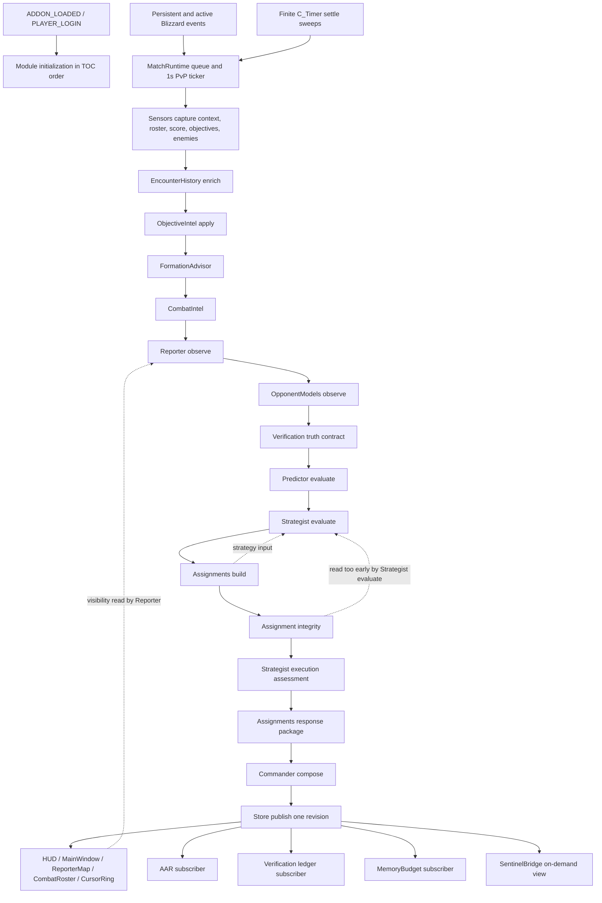
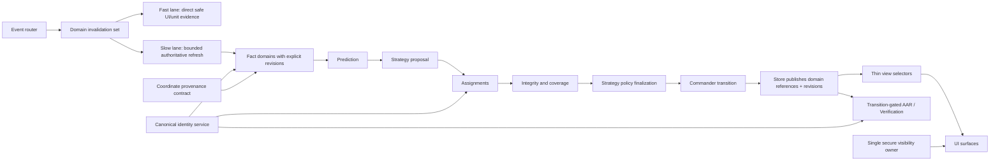

# Architecture Assessment

Date: 2026-07-13  
Candidate: `6.1.0-alpha.25`

## Disposition

**Retain the architecture. Repair local correctness and safety defects. Refactor bounded subsystems. Replace no subsystem. Rebuild nothing.**

The repository already has the right macro-architecture for an addon of this scope: one TOC-defined bootstrap, one runtime scheduler, one publication Store, separated data/runtime/UI modules, manual user authority, and bounded strategic evidence. The release problems are implementation-contract failures inside that architecture, not proof that the architecture cannot meet the mission.

## Repository Map

| Area | Purpose | Assessment |
| --- | --- | --- |
| `Core/` | Bootstrap, utility wrappers, command views, Store, developer diagnostics | Retain. Store reconciliation and bootstrap health need repair. Diagnostics is correctly release-excluded. |
| `Data/` | Map definitions, objective rules, capabilities, compositions, plans, doctrine, sources, patch knowledge | Retain. Reviewed-data freshness and locale policy need release ownership. |
| `Runtime/` | Sensors, live intel, prediction, strategy, assignments, Commander, persistence, verification, orchestration | Retain and stabilize. This is the principal correctness/performance work area. |
| `Features/` | Optional cursor/reticle/nameplate visuals | Retain as optional; profile and benchmark continuous work. |
| `UI/` | HUD, Reporter map, secure roster, main board, AAR, options | Retain. Centralize secure visibility and continue bounded decomposition. |
| `KWRSentinel/` | Separate same-client compact HUD with standalone fallback | Retain as optional and local-only. It is not a multiplayer relay implementation. |
| `tests/` | Large deterministic smoke plus bounded-state soak | Retain; add focused contract, lifecycle, release-package, and real timing tests. |
| `tools/` | Validation, knowledge audit, packaging, package audit, release exclusions | Retain; close distribution-load, provenance, version, and reproducibility gaps. |
| `knowledge/` | Knowledge review process and patch template | Retain; validator checks structure more than factual correctness. |
| `docs/`, root plans | Product, QA, architecture, release, visual, handoff, and policy guidance | Consolidate authority and synchronize versions; do not treat status prose as proof. |

## Entrypoints And Load Order

The main entrypoint is `KnomercyWarRoom.toc`. Its order is:

1. Core bootstrap, build flags, command formatting/review, utilities, Store.
2. Twenty reviewed Data modules.
3. Runtime modules from identity/history/sensors through Commander, AAR, verification, SentinelBridge, and finally MatchRuntime.
4. CursorRing.
5. UI foundation, compact surfaces, presentation, split MainWindow helpers, MainWindow, AARWindow, Options.

`Core/Addon.lua` exports `_G.KWR`, records modules in TOC order, initializes all modules on `ADDON_LOADED`, enables modules on `PLAYER_LOGIN`, and disables in reverse order on `PLAYER_LOGOUT`. Module failures are caught individually, but bootstrap still sets `KWR.ready=true`; required/optional module health is not modeled.

The separate `KWRSentinel/KWRSentinel.toc` loads Core, Theme, Bridge, NativeUI, and HUD. `KWRSentinel/Core.lua` exports `_G.KWRSentinel`. Its Bridge reads `_G.KWR.SentinelBridge` only when both addons are on the same client and KWR is ready; otherwise it uses local unit APIs. There is no network transport.

The release manifest removes `Core/Diagnostics.lua` and `Runtime/Preview.lua` and removes their TOC lines. Runtime checks through `BuildInfo` safely degrade those commands. The package pipeline does not execute a release-pruned TOC load test.

## Current Runtime Diagram

The dashed edges are the principal architectural defects. Assignments depend on strategy while strategy's doctrine flags depend on assignment integrity, but current ordering gives Strategist an empty integrity object. Reporter also reads UI frame visibility to decide whether to publish detailed path data.

## Dependency Map

| Layer/module | Primary dependencies | Downstream consumers | Concern |
| --- | --- | --- | --- |
| Store | Util only | Runtime subscribers and all UI | Lossy generic tokens can retain stale branches. |
| Sensors | Util, Maps, TeamResolver, EnemyIntel | MatchRuntime | Correct owner; widget row source naming breaks authority. |
| ObjectiveIntel | Maps, MemoryBudget | Strategy/assignments/UI | English message parsing and coarse flag clearing. |
| Reporter | Maps, Capabilities, MemoryBudget, UI frame state | Predictor, Strategist, UI | UI coupling, inferred coordinates, absent-track retention. |
| Predictor | Maps | Strategist, Commander | Cohesive and bounded; retain. |
| Strategist | plans/doctrine/capability/source data | Assignments, Commander | Large owner and pre-integrity evaluation cycle. |
| Assignments | doctrine, capabilities, rules, overrides | Commander and UI | Response recovery bug; identity and strategy cycle. |
| Commander | Assignments, Doctrine, Store, MemoryBudget | Store/UI/AAR | Oversized; metrics count evaluations as commands. |
| AAR | Store, Commander, review/learning/models | SavedVariables/UI | Bounded history; active match is not reload-durable. |
| Verification | Store, assignments, commander, memory | Local reports | Heavy entry and memory work before transition dedupe. |
| MemoryBudget | Store plus direct reach into runtime owners | Diagnostics/release reports | Cross-cutting coupling and callback signature defect. |
| UI | Store DTOs, command formatters, secure owners | User | Mostly separated; secure visibility has bypass paths. |

Static dependencies are acyclic enough at load time because TOC order defines all tables before MatchRuntime runs. Runtime coupling is higher than the file layout implies: MatchRuntime calls nearly every engine directly, MemoryBudget reaches into most state owners, Reporter reads UI, and MainWindow coordinates multiple compact surfaces.

## State Ownership

### Durable state

| State | Owner | Bound | Migration status |
| --- | --- | --- | --- |
| `KWR_DB.profile` | Core bootstrap plus owning UI/feature modules | Structurally finite | Defaults merged; scalar types not validated. |
| `journal.history` | AAR | 8 matches | One old navigation migration only; active match not persisted. |
| `enemyNotes` | EnemyIntel | 320 non-empty notes | Pruned by age/priority; identity can collide. |
| `encounters.players` | EncounterHistory | 240 | Pruned; full lowercased names used. |
| `opponentModels.players` | OpponentModels | 240 | Added outside root defaults; processed IDs bounded to 120. |
| `learning.plans` | Learning | 120 | Pruned. |
| `assignmentOverrides.players` | AssignmentOverrides | Unbounded records | Short-name keys; clear leaves tombstone records; no migration. |
| `KWR_SENTINEL_DB.profile` | Sentinel Core/HUD | Structurally finite | Defaults only; no schema version or migration. |

### Transient authoritative state

| State | Owner | Lifecycle |
| --- | --- | --- |
| Current published revision | Store | Replaced each MatchRuntime publication. |
| Refresh queue/ticker/metrics | MatchRuntime | Ticker only in PvP; events registered once; finite settle callbacks. |
| Team resolution | TeamResolver | Reset outside PvP or session change. |
| Enemy records/tokens | EnemyIntel | Reset per battlefield session. |
| Objective events/carriers/timers | ObjectiveIntel | Reset per compatible session. |
| Reporter tracks/routes/events | Reporter | Reset per session; absent rows are not swept. |
| Combat observations/cache | CombatIntel | Session-reset and bounded by known entities. |
| Commander active play/history/metrics | Commander | Session-reset; history bounded to 16. |
| Verification ledger | Verification | Process memory; bounded to 60. |
| Roster specialization cache | Sensors | Process lifetime; no cap/prune. |
| Strategist caches | Strategist | Time/signature cache; cleared under memory trim. |

Store state is only immutable by convention. `Store:Publish` mutates the incoming snapshot during reconciliation and exposes live tables to every subscriber. Explicit domain revision contracts would be safer than generic deep copying or lossy structural hashing.

## Event And Lifecycle Map

`MatchRuntime` registers eight persistent events and 34 active events once during initialization. Outside PvP, active events are ignored after incrementing the event diagnostic. In PvP, a one-second ticker and event queue drive full refreshes with a 0.40-second minimum interval and at most one chained follow-up.

Persistent events: world enter/leave, zone change, group roster, unit name, role, specialization, and battlefield status.

Active domains: match lifecycle, score/widgets/POIs/vignettes, nameplates and targets, unit health/aura, arena opponents, unit spellcasts, battleground system messages, death/alive, and combat lockdown.

Additional registrations:

| Owner | Registration/work | Cleanup |
| --- | --- | --- |
| Sensors | EventRegistry callbacks for inspect and specialization | No explicit unregister; process-lifetime owner. |
| RosterInspector | EventRegistry callback for inspect ready | No explicit unregister; process-lifetime owner. |
| CombatRoster | combat, target/focus, health events | Frame remains process-lifetime; Store unsubscribes on logout. |
| HUD | match complete, combat release, transition events; finite timer bursts | Timer tokens suppress stale callbacks; Store unsubscribes. |
| Presentation | combat/world/zone events; finite timer callbacks | Refresh token suppresses stale callbacks; Store unsubscribes. |
| CursorRing | target/nameplate/world events and conditional OnUpdate | Store unsubscribes, but driver script/events remain. |
| Sentinel HUD | unconditional OnUpdate frame, work only while HUD shown | No `OnDisable`; process-lifetime. |
| Launcher | OnUpdate only while dragging | Explicitly removed on drag stop. |

Timer inventory: one MatchRuntime ticker; MatchRuntime queued `After` calls, six zone settle passes, four roster settle passes, three final passes; HUD and Presentation finite invalidation bursts; QuickCall three-second status reset; AAR one-second auto-open. Token checks exist for queue, transition, HUD, Presentation, and QuickCall work. AAR auto-open has no lifecycle token.

## Communication And Trust Boundaries

There is no current addon-message registration, prefix, receive path, serialization, or remote authority. Main addon chat behavior is limited to six fixed secure `/instance` Quick Calls activated by a hardware click. Other command text is shown locally or prepared in a copy dialog. Sentinel's bridge is same-process state access, not multiplayer communication.

Trust sources, highest to lowest, should remain:

1. Qualified Blizzard widget/API truth.
2. Direct safe visible-unit observation.
3. Labeled last-seen evidence with TTL.
4. Labeled teammate-engagement or assignment inference without coordinates.
5. Reviewed static definitions and heuristic doctrine.
6. Historical/local learned context, never promoted to live fact.

Current violations are the objective source mismatch and inferred enemy coordinates. Short-name identity is also an unsafe trust shortcut.

## Strengths To Preserve

- One MatchRuntime scheduler and one Store publication point.
- Stable event registration rather than risky in-combat event churn.
- Manual user authority and fixed secure click controls.
- Explicit unknown handling and safe utility wrappers.
- Reviewed, separate data modules with patch/source metadata.
- Map-family engines and deterministic doctrine fixtures.
- Bounded major histories, event ledgers, and runtime duration samples.
- Release exclusion manifest for diagnostics and preview.
- Developer package extraction and hash verification.
- Compact and expanded surfaces consuming shared command state.

## Weaknesses To Repair

- Store equality is neither complete nor contract-driven.
- Identity ownership is duplicated and short-name based in critical paths.
- Strategy and assignment integrity have a hidden cyclic contract.
- Reporter owns movement inference but reads UI visibility and fabricates spatial precision.
- Secure visibility has multiple owners despite an existing queue abstraction.
- MemoryBudget is both a policy owner and a direct inspector of many modules.
- Bootstrap cannot distinguish required module failure from optional degradation.
- Large modules combine policy, state transition, formatting, metrics, and retention.
- Persistence evolution is implicit rather than versioned and fixture-backed.
- Test/package evidence does not model the release runtime or actual performance.

## Target Architecture

This target does not add a second engine. It makes existing ownership explicit:

- Domain revisions replace generic deep equality.
- A canonical identity service owns GUID/full-name resolution and ambiguity.
- Coordinate provenance prevents semantic inference from becoming spatial evidence.
- Strategy proposal and post-assignment finalization break the hidden cycle.
- One secure visibility controller owns all protected ancestors.
- Transition signatures precede expensive AAR/Verification projection.
- Fast unit-event presentation does not invalidate full strategy by default.

## Migration Strategy

1. Add failing deterministic tests for all Phase 0 defects without changing SavedVariables.
2. Repair objective and coordinate provenance locally.
3. Disable lossy Store reuse or introduce complete per-domain revisions behind the existing Store API.
4. Centralize secure visibility while preserving current profile keys and surface names.
5. Introduce canonical identity fields while reading legacy short-name override keys as fallback.
6. Write a one-way, idempotent migration that copies unambiguous legacy records and quarantines ambiguous records; do not delete original data in the first release.
7. Split Strategist proposal/finalization without changing the published state shape initially.
8. Add domain revisions and thin selectors incrementally; retain compatibility fields through at least one external-test cycle.
9. Refactor oversized modules only after behavioral parity tests exist.

## Compatibility Rules

- Preserve `KWR_DB`, `KWR_SENTINEL_DB`, slash commands, existing profile keys, and current exported Store fields.
- Do not rename map keys, plan IDs, assignment roles, command fields, or AAR fields during Phase 0/1.
- Never delete ambiguous identity records automatically. Mark them legacy/ambiguous and require explicit resolution.
- Keep release Preview/Diagnostics exclusions and developer command behavior.
- Keep Sentinel local-only until a separate policy-approved transport project completes every gate.
- Treat unknown or malformed historical fields as recoverable input, not proof that the whole database should be reset.

## Decision Gates

| Gate | Owner decision required | Default recommendation |
| --- | --- | --- |
| Locale | English-only external alpha vs localized objective parsing | English-only controlled alpha until localized fixtures exist. |
| AAR reload | Persist active checkpoint vs document loss | Persist only after privacy/size contract; document loss for first controlled alpha. |
| Legacy identity | How long to preserve ambiguous short-name records | Preserve for one major release and expose a local review/reset action. |
| Performance threshold | p95 2 ms vs 4 ms conflict | Use 2 ms pass, 4 ms warning, 6 ms fail for external test; retain 10 ms single-refresh hard stop. |
| Sentinel | Required tester package vs optional separate surface | Optional and separately measured. |
| Transport | Future automatic addon messages | Remain prohibited; separate architecture/security review required. |

## Classification By Subsystem

| Subsystem | Classification | Rationale |
| --- | --- | --- |
| Bootstrap/TOC | Repair locally | Health gating and version checks; structure is sound. |
| Store | Refactor subsystem | Correct API, unsafe implementation contract; domain revisions are needed. |
| Sensors/objective truth | Repair locally | Source normalization and provenance fixes are bounded. |
| Reporter | Refactor subsystem | Track lifecycle, provenance, and UI coupling need a coherent contract. |
| Predictor | Retain | Cohesive, downstream-only, deterministic. |
| Strategist/Assignments | Refactor interface boundary | Preserve engines; split proposal from post-integrity policy. |
| Commander | Refactor subsystem after release blockers | Behavior is valuable; size and metric ownership are high risk. |
| Persistence | Repair and add migration framework | Existing root and data are compatible; validation is missing. |
| UI | Repair secure visibility; continue local splits | Existing design system and surfaces should remain. |
| Sentinel | Retain optional/local | No need to replace; transport is explicitly absent. |
| Test/build pipeline | Repair locally | Strong foundation; release-load, realistic timing, provenance, and docs sync are missing. |
| Whole addon | **Do not rebuild** | No evidence of an unfixable architecture. |
